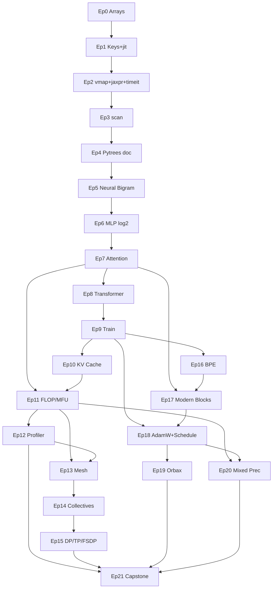

# LLMs in JAX: Zero to Hero + Compute Analysis — Syllabus

**Assumption:** Jupyter notebooks for Episodes 0–10, then a small installable Python package (`llm_jax/`) from Episode 11. Scale Track targets multi-host TPU v4 or 8×GPU; laptop path uses CPU/single GPU throughout Module 0–1 and most of Module 2.

**Course length:** 22 episodes (0–21), ~8–12 hours total.

**Spine task:** Reflecting-digits sequence `012345678987654321…` — used to show bigram/MLP limits, attention wins, RoPE helps.

---

## Module Summaries

**Module 0 — JAX Foundations (Episodes 0–3)**  
**Module 0 bridge — Pytrees (Episode 4)**  
Students go from JAX arrays to idiomatic compiled JAX on CPU or one GPU. Episode 1 introduces **splittable PRNG keys**, a **weight + bias** `dict`, and `jax.jit` (tracing). Episode 2 **`jit` ∘ `vmap`** on matmul, **`timeit`** eager vs compiled, and **jaxpr / XLA** (what `jit` actually does). Episode 3 adds **`jax.vmap`** and **`lax.scan`**, with **`scan` vs a Python `for` loop** on prefix sum (no `jit`). Differentiable training with `value_and_grad` starts in **Episode 4** — the full official [JAX Pytrees](https://docs.jax.dev/en/latest/pytrees.html) walkthrough (MLP `params`, `jax.tree.map`, `grad`, `jit` SGD). Module 1 (Episodes 5+) continues Karpathy’s makemore arc on reflecting digits.

**Module 1 — Transformer Build (Episodes 4–10)**  
Mirrors Karpathy’s makemore/GPT arc in pure JAX: neural bigram → MLP → causal self-attention → stacked transformer → training loop → generation with KV cache. The reflecting-digits task exposes bigram/MLP failure (~log 2 nats) and attention success. **Episode 4** is the official [JAX Pytrees](https://docs.jax.dev/en/latest/pytrees.html) exercise end-to-end; later episodes reuse `jax.tree.map` for real model `params`.

**Module 2 — Compute & Distributed (Episodes 11–15)**  
Roofline models, MFU, `jax.profiler`, and HLO autopsy. Students build a cost model for attention and MLP blocks, then scale out with `Mesh`, `PartitionSpec`, and collective ops—including the adjoint story (AllGather backward = ReduceScatter). Episodes 14–15 are Buchanan #1 depth applied to transformer layers, with conceptual + one worked example each for data parallel, tensor parallel, and FSDP.

**Module 3 — Production & Scale (Episodes 16–21)**  
Real text: BPE tokenization, Shakespeare or OpenWebText slice, LR warmup + cosine decay, AdamW, gradient clipping. Modern blocks (RMSNorm, SwiGLU, GQA) appear as brief upgrades. Orbax checkpointing, mixed precision, and a profiled “one training step” at GPT-2-ish scale close the course.

---

## Episode 0: JAX Arrays, Shapes, and Immutability

**Module:** 0  
**Duration:** 14 min  
**Prerequisites:** Python, basic NumPy  
**Hardware:** CPU | Single GPU

### Learning objectives
- Explain JAX arrays vs NumPy and the functional programming model
- Create arrays with `jax.numpy`, read `.shape` / `.dtype`, and index like NumPy
- Show that JAX arrays are immutable; update with `.at[...].set(...)`
- Introduce capitalized shape letters in docs: `(N,)`, `(I, J)`

### Narrative hook
Before we train anything, we need fluent `jnp` — same API as NumPy, but functional and immutable. PRNG keys and `jit` come in Episode 1; the [Pytrees](https://docs.jax.dev/en/latest/pytrees.html) doc exercise in Episode 4; reflecting-digits LM in Episode 5.

### Concepts taught
| Concept | Depth | New vs review |
|---------|-------|---------------|
| JAX arrays, `jax.numpy` | intro | new |
| Shapes, indexing | practice | new |
| Immutability, `.at[]` | practice | new |
| Functional style (preview) | intro | new |

### Math & intuition (on whiteboard)
- Vectors `(N,)`, matrices `(I, J)` — suffix naming starts in ML episodes
- Immutability: `x.at[i, j].set(v)` returns a new array
- Preview: JAX prefers pure functions → sets up `jit` in Episode 1

### Code we build
- **New files/functions:** notebook-only demos — `jnp.array`, `jnp.arange`, `.reshape`, `.at`
- **Lines of core logic (approx):** ~25
- **Key JAX APIs:** `jax.numpy`, `ndarray.at`
- **Repo tag:** `ep00-arrays-immutability`

### JAX docs to review
- [JAX 101 — Introduction](https://jax.readthedocs.io/en/latest/jax-101.html)
- [`jax.numpy`](https://jax.readthedocs.io/en/latest/jax.numpy.html)
- [JAX 101 — Just In Time Compilation](https://jax.readthedocs.io/en/latest/jax-101.html#just-in-time-compilation-with-jit) (preview)

### Success metrics (how we know it worked)
- **Functional:** `x.at[0].set(99)` returns new array; original `x` unchanged
- **Compute:** N/A (tiny arrays on CPU)

### Compute sidebar (required)
- **Question answered:** How many bytes is a `(3, 4)` `float32` array?
- **Analysis type:** memory budget
- **Concrete deliverable:** `3 × 4 × 4 = 48` bytes

### Running demo
- **Input:** Create `x` vector and `m` matrix; print shapes; demo immutability error + `.at`
- **Expected output:** `TypeError` on `x[0] = ...`; updated array via `.at`
- **Common failure modes:** Forgetting to reassign `x = x.at[...].set(...)`; shape mismatch in `.set`

### Exercise (student does alone)
- **Task:** `y = jnp.arange(5)` → print `y.shape` and `y[3]`
- **Hint:** Same as NumPy
- **Solution sketch:** Two print lines.

### Connection to Buchanan / Karpathy
- **Karpathy parallel:** NumPy fluency before makemore models
- **Buchanan parallel:** none

### Teaser for next episode
Next: PRNG keys, a weight dict, and `jit`.

---

## Episode 1: PRNG Keys, Weight + Bias Dict, and `jit`

**Module:** 0  
**Duration:** 18 min  
**Prerequisites:** 0  
**Hardware:** CPU | Single GPU

### Learning objectives
- Create typed PRNG keys with `jax.random.key` and split them with `jax.random.split` before every random draw
- Package a simple linear layer as `params = {"w": ..., "b": ...}` and run `y = x @ w + b`
- Wrap a pure forward function in `jax.jit` and explain tracing vs execution

### Narrative hook
Before we train anything, we need two JAX habits: **explicit randomness** (no hidden global RNG state) and **compiled pure functions** over a parameter dict. We start with keys and splitting, build the smallest useful model—a matrix multiply plus bias—then `jit` it.

### Concepts taught
| Concept | Depth | New vs review |
|---------|-------|---------------|
| PRNG keys: `key`, `split`, consume subkey | practice | new |
| Params as `dict` (`w`, `b`) | practice | new |
| Broadcasting (`+ b` over batch) | intro | new |
| `jax.jit` tracing (preview) | practice | new |

### Math & intuition (on whiteboard)
- PRNG mental model: key is state; `key, subkey = split(key)`; random ops **consume** `subkey`—never reuse
- Linear layer: \(y = x w + b\) with shapes \(x \in \mathbb{R}^{B \times D_{in}}\), \(w \in \mathbb{R}^{D_{in} \times D_{out}}\), \(b \in \mathbb{R}^{D_{out}}\)
- **Broadcasting mini-section:** \(b\) has shape `(D_out,)` and broadcasts across batch rows of `x @ w` — align trailing dims; compare with [`jnp.broadcast_shapes`](https://docs.jax.dev/en/latest/_autosummary/jax.numpy.broadcast_shapes.html). **Rules reference:** [NumPy broadcasting](https://numpy.org/doc/stable/user/basics.broadcasting.html) (JAX follows the same rules)
- `jit` preview: first call records ops; details + jaxpr in Episode 2

### Notebook — mini-section: Broadcasting

Short markdown cell + 2–3 code cells after `forward`:

1. **Rules (link out):** JAX uses [NumPy broadcasting rules](https://numpy.org/doc/stable/user/basics.broadcasting.html) — compare shapes from the **right**; dimensions match if equal or one is `1`.
2. **Our case:** `x @ w` is `(B, D_out)`; `b` is `(D_out,)` → `b` broadcasts to every row (conceptually `b` becomes `(1, D_out)` then `(B, D_out)`).
3. **Check shapes:** `jnp.broadcast_shapes((B, D_out), (D_out,))` → `(B, D_out)`; show a failing pair `(3, 4)` vs `(4, 1)` vs `(4,)`.
4. **Takeaway:** bias add is cheap — no extra storage for the broadcast; XLA fuses it with the matmul when `jit`ted.

### Code we build
- **New files/functions:** `models/linear.py` — `init_params(key, d_in, d_out)`, `forward(params, x)`; demo `jitted_forward = jit(forward)`
- **Lines of core logic (approx):** ~45
- **Key JAX APIs:** `jax.random.key`, `jax.random.split`, `jax.random.normal`, `jax.jit`
- **Repo tag:** `ep01-keys-jit`

### JAX docs to review
- [Pseudorandom numbers](https://jax.readthedocs.io/en/latest/random-numbers.html) — splittable keys, consume-on-use
- [`jax.random.key`](https://jax.readthedocs.io/en/latest/_autosummary/jax.random.key.html)
- [`jax.random.split`](https://jax.readthedocs.io/en/latest/_autosummary/jax.random.split.html)
- [JAX 101 — Just-in-time compilation with `jit`](https://jax.readthedocs.io/en/latest/jax-101.html#just-in-time-compilation-with-jit) (preview; jaxpr in Ep 2)
- [`jax.jit`](https://jax.readthedocs.io/en/latest/_autosummary/jax.jit.html)
- [NumPy broadcasting](https://numpy.org/doc/stable/user/basics.broadcasting.html) — rules JAX follows
- [`jax.numpy.broadcast_shapes`](https://docs.jax.dev/en/latest/_autosummary/jax.numpy.broadcast_shapes.html)

### Success metrics (how we know it worked)
- **Functional:** `split` before `normal` yields reproducible draws; `jitted_forward(params, x)` matches eager `forward(params, x)`
- **Compute:** Second `jit` call noticeably faster than first (compile once)

### Compute sidebar (required)
- **Question answered:** What is the FLOP cost of one forward pass \(y = xw + b\) for batch size `B`?
- **Analysis type:** FLOP accounting
- **Concrete deliverable:** `2 * B * D_in * D_out` for matmul + `B * D_out` for bias broadcast

### Running demo
- **Input:** `B=64`, `D_in=10`, `D_out=10`, `key=jr.key(0)`; init `w,b` with split subkeys; compare eager vs `jit`
- **Expected output:** Bitwise match eager/jit; timing: compile once, then fast steps
- **Common failure modes:** Reusing a key after `split`; in-place mutation inside a `jit`ted function

### Exercise (student does alone)
- **Task:** `split` a root key into subkeys for `w` and `b` init; verify a second run with the same root key is identical.
- **Hint:** `key, k_w, k_b = jr.split(key, 3)`
- **Solution sketch:** Never call `normal` on the root key after splitting.

### Connection to Buchanan / Karpathy
- **Karpathy parallel:** makemore MLP forward skeleton (weights in a dict)
- **Buchanan parallel:** fills gap: JAX 101 (keys, `jit`) before Buchanan’s bare-metal transformer

### Teaser for next episode
We can compile a forward pass—next, vectorize with `vmap`, `jit` a matmul, and time eager vs compiled.

---

## Episode 2: Vectorized `jit`, Timing Matmul, and jaxpr

**Module:** 0  
**Duration:** 16 min  
**Prerequisites:** 1  
**Hardware:** CPU | Single GPU

### Learning objectives
- Compose `jax.jit` with `jax.vmap` to compile a batched matmul (or batched forward from Episode 1)
- Time eager vs `jit` matmul with `timeit` (and `block_until_ready` on accelerator)
- Separate compile time from steady-state run time
- Explain the compile pipeline: **trace → jaxpr → StableHLO → XLA → machine code**
- Inspect a **jaxpr** with `jax.make_jaxpr` before and after `jit`

### Narrative hook
Episode 1 compiled one call. Real workloads batch over examples—`vmap` vectorizes, `jit` compiles the whole thing. A single matmul is enough to *feel* the gap between Python dispatch and XLA—and to see the **jaxpr** JAX actually hands to the compiler.

### Notebook text block — what `jit` is doing

Include a markdown cell (students read, not memorize):

> **`jax.jit` does not “run Python faster.”** On the first call with given array **shapes and dtypes**, JAX **traces** your function: array values are replaced by **tracers**, and each `jnp` op records a primitive into a **jaxpr** (JAX program). That jaxpr is **lowered** to **StableHLO**, then **XLA** (Accelerated Linear Algebra) optimizes and emits code for your device (CPU/GPU/TPU). Later calls with the **same shapes/dtypes** reuse the compiled executable; new shapes trigger **recompilation**.
>
> Read: [Tracing](https://docs.jax.dev/en/latest/tracing.html) · [Key concepts — jaxpr & XLA](https://docs.jax.dev/en/latest/key-concepts.html) · [JAX internals: jaxpr](https://docs.jax.dev/en/latest/jaxpr.html)

### Concepts taught
| Concept | Depth | New vs review |
|---------|-------|---------------|
| `jax.vmap` batching | intro | new |
| `jit` ∘ `vmap` | practice | new |
| Trace → jaxpr → XLA pipeline | intro | new |
| `jax.make_jaxpr` inspection | practice | new |
| `timeit` / wall-clock benchmarking | practice | new |
| `block_until_ready` when timing | intro | new |

### Math & intuition (on whiteboard)
- Batched matmul: `(B, M, K) @ (B, K, N) → (B, M, N)` or `vmap(dot)(A, B)` on leading batch axis
- Pipeline diagram: `Python forward` → **trace** → `jaxpr` → `StableHLO` → **XLA compile** → **run** on device
- First `jit` call = trace + compile; later calls = execute cached executable
- Timing pitfall: async dispatch — must `block_until_ready` before stopping the clock on GPU/TPU

### Demo — show jaxprs

After the text block, one code cell:

```python
from jax import make_jaxpr

def matmul_fn(a, b):
    return jnp.dot(a, b)

print(make_jaxpr(matmul_fn)(A, B))       # eager trace
print(make_jaxpr(jit(matmul_fn))(A, B)) # often wraps sub-jaxpr in `jit` primitive
```

Students compare: primitives (`dot_general`, `add`, …) vs Python source. Re-run after changing shape to preview **retrace** (ties to Ep 10).

### Code we build
- **New files/functions:** `bench/matmul_bench.py` — `matmul`, `jitted_matmul = jit(matmul)`, `batched_matmul = jit(vmap(matmul))`; `timeit_eager_vs_jit()`
- **Lines of core logic (approx):** ~35
- **Key JAX APIs:** `jax.jit`, `jax.vmap`, `jax.numpy.dot`, `jax.make_jaxpr`, `jax.block_until_ready`, `timeit`
- **Repo tag:** `ep02-jit-vmap-timeit`

### JAX docs to review
- [Tracing](https://docs.jax.dev/en/latest/tracing.html) — tracers, `make_jaxpr`, static vs traced ops
- [Key concepts — jaxpr & XLA layering](https://docs.jax.dev/en/latest/key-concepts.html)
- [JAX internals: The jaxpr language](https://docs.jax.dev/en/latest/jaxpr.html)
- [JAX 101 — Automatic vectorization with `vmap`](https://jax.readthedocs.io/en/latest/jax-101.html#automatic-vectorization)
- [JAX 101 — Just-in-time compilation with `jit`](https://jax.readthedocs.io/en/latest/jax-101.html#just-in-time-compilation-with-jit)
- [`jax.make_jaxpr`](https://docs.jax.dev/en/latest/_autosummary/jax.make_jaxpr.html)
- [`jax.vmap`](https://docs.jax.dev/en/latest/_autosummary/jax.vmap.html)
- [`jax.block_until_ready`](https://docs.jax.dev/en/latest/_autosummary/jax.block_until_ready.html)
- [Transfer guard and async dispatch](https://jax.readthedocs.io/en/latest/async_dispatch.html) (timing pitfalls)

### Success metrics (how we know it worked)
- **Functional:** `jitted_matmul(A, B)` matches eager `dot`; `vmap` batch matches loop over batch index; printed jaxpr shows `dot_general` (or similar) primitive
- **Compute:** Printed `timeit` table: eager ≫ jitted steady-state; first jitted call includes compile spike

### Compute sidebar (required)
- **Question answered:** How much faster is jitted matmul after warmup on your machine?
- **Analysis type:** timing
- **Concrete deliverable:** Small table: eager ms | jitted (1st call) ms | jitted (steady) ms for fixed `(M, N, K)`

### Running demo
- **Input:** `A, B` shapes `(512, 512)`; batched `(32, 128, 128)`; `timeit` × 10 after 3 warmup runs
- **Expected output:** Correctness check; steady jitted call clearly faster than eager on CPU/GPU
- **Common failure modes:** Timing without `block_until_ready`; including first compile in the average without labeling it; expecting jaxpr to show fused XLA kernels (fusion happens after jaxpr)

### Exercise (student does alone)
- **Task:** `make_jaxpr` on `jit(vmap(forward))` for `B=64`; `timeit` eager vs jitted. Paste one jaxpr line (e.g. `dot_general`) in a comment.
- **Hint:** Warm up once; separate first call from the loop average
- **Solution sketch:** Two-row timing table + jaxpr showing batched/matmul primitive.

### Connection to Buchanan / Karpathy
- **Karpathy parallel:** batched forward passes before training loops
- **Buchanan parallel:** none (light systems taste without roofline yet)

### Teaser for next episode
Next: `scan` vs a Python loop—prefix sum without `jit`.

---

## Episode 3: `scan` vs Python Loop — Prefix Sum

**Module:** 0  
**Duration:** 14 min  
**Prerequisites:** 1, 2  
**Hardware:** CPU | Single GPU

### Learning objectives
- Implement inclusive prefix sum with a Python `for` loop (eager, no `jit`)
- Implement the same prefix sum with `jax.lax.scan` and verify bitwise match
- Compare the two with `timeit` on a long 1D array

### Narrative hook
Not every loop should be a Python `for`. `scan` threads carry state through a sequence in JAX-friendly form—prefix sum is the cleanest before/after picture. We stay **without `jit`** here so the comparison is loop semantics, not compilation.

### Concepts taught
| Concept | Depth | New vs review |
|---------|-------|---------------|
| `jax.lax.scan` carry loops | practice | new |
| Prefix sum as scan | practice | new |
| Python `for` vs `scan` | practice | new |
| `timeit` on loops | practice | review |

### Math & intuition (on whiteboard)
- Inclusive prefix: \(y_t = \sum_{i \le t} x_i\)
- `scan` step: carry \(c\), input \(x_t\) → new carry \(c + x_t\), output \(c + x_t\)
- \((c_{t+1}, y_t) = (c_t + x_t,\; c_t + x_t)\) with \(c_0 = 0\)
- Shape: `x` is `(T,)` → `scan` returns `(T,)` stacked outputs

### Code we build
- **New files/functions:** `bench/prefix_sum.py` — `prefix_sum_loop(x)`, `prefix_sum_scan(x)`; `timeit_loop_vs_scan()`
- **Lines of core logic (approx):** ~30
- **Key JAX APIs:** `jax.lax.scan`, `timeit`
- **Repo tag:** `ep03-scan-prefix-sum`

### JAX docs to review
- [`jax.lax.scan`](https://jax.readthedocs.io/en/latest/_autosummary/jax.lax.scan.html)
- [JAX 101 — `scan` for loops](https://jax.readthedocs.io/en/latest/jax-101.html#writing-a-loop-using-scan)

### Success metrics (how we know it worked)
- **Functional:** `prefix_sum_scan(x)` matches `prefix_sum_loop(x)` and `jnp.cumsum(x)` on test vectors
- **Compute:** `timeit` printed for `T` large enough to see a gap (e.g. `T=100_000`)

### Compute sidebar (required)
- **Question answered:** For prefix sum, when does `scan` beat a Python loop?
- **Analysis type:** timing
- **Concrete deliverable:** Two-row `timeit` table: Python loop ms | `scan` ms at `T=10_000` and `T=100_000`

### Running demo
- **Input:** `x = jnp.ones(100_000)`; run loop vs `scan` (no `jit` on either)
- **Expected output:** Identical sums; `scan` faster at large `T`
- **Common failure modes:** Accidentally wrapping in `jit`; wrong carry init; off-by-one inclusive vs exclusive

### Exercise (student does alone)
- **Task:** Write exclusive prefix sum (output \(y_t = \sum_{i < t} x_i\)) with `scan`; `timeit` against your Python loop.
- **Hint:** Exclusive = output carry *before* adding \(x_t\)
- **Solution sketch:** Body returns `(c + x, c)` instead of `(c + x, c + x)`.

### Connection to Buchanan / Karpathy
- **Karpathy parallel:** none directly—pedagogical loop replacement
- **Buchanan parallel:** `scan` foreshadows compiled training steps (Ep 9+)

### Teaser for next episode
Module 0 closes — next, the full [JAX Pytrees](https://docs.jax.dev/en/latest/pytrees.html) doc exercise: nested `params`, `grad`, and SGD with `jax.tree.map`.

---

## Episode 4: Pytrees — Full [JAX Docs](https://docs.jax.dev/en/latest/pytrees.html) Exercise

**Module:** 0 → 1 bridge  
**Duration:** 22 min  
**Prerequisites:** 0–3  
**Hardware:** CPU | Single GPU

### Learning objectives
- Define pytrees: **nodes** (dict / list / tuple) vs **leaves** (arrays, scalars) with `jax.tree.leaves`
- Apply `jax.tree.map` (unary and multi-arg) over nested structures
- Build the doc’s MLP `params` as a **list of layer dicts** (`weights`, `biases`)
- Train with `forward` → `loss_fn` → `jax.grad` → `jax.tree.map` SGD inside `@jax.jit`
- Inspect structure with `jax.tree.structure` and **key paths** via `tree_flatten_with_path` + `keystr`
- Recognize gotchas: tuple `.shape` as nodes, `None` leaves, unsortable dict keys

### Narrative hook
This episode **is** the official JAX pytrees page, worked top to bottom in the notebook. No reflecting digits yet—just a tiny MLP on synthetic `(x, y)` so `params`, `grads`, and `tree.map` click before Karpathy’s arc.

### Concepts taught
| Concept | Depth | New vs review |
|---------|-------|---------------|
| Pytrees: nodes vs leaves | mastery | new |
| `jax.tree.leaves`, `jax.tree.map` | mastery | new |
| List-of-dicts MLP `params` | practice | new |
| `jax.grad` on pytrees | practice | new |
| `@jax.jit` + `tree.map` SGD update | practice | new |
| `tree_structure`, key paths | intro | new |
| Gotchas + `tree_transpose` pattern | intro | new |

### Math & intuition (on whiteboard)
- Layer \(i\): \(h = \text{relu}(x W_i + b_i)\); final layer linear
- MSE loss: \(\text{mean}((f_\theta(x) - y)^2)\)
- SGD: \(\theta \leftarrow \theta - \eta \nabla_\theta L\) applied **per leaf** via `tree.map(lambda p, g: p - η*g, params, grads)`
- `grads` is a pytree with **identical structure** to `params`

### Code we build
Follow the doc sections in order:

1. **What is a pytree?** — `example_trees`; `jax.tree.leaves` on nested list/dict/tuple
2. **`jax.tree.map`** — double a list-of-lists; add two parallel trees
3. **MLP example** — `init_mlp_params(layer_widths)` → list of `dict(weights=…, biases=…)`; `tree.map(lambda x: x.shape, params)`; `forward`; `loss_fn`; `@jax.jit def update(...)` with `grad` + `tree.map` SGD
4. **`tree_structure`** — debug print `PyTreeDef`
5. **Key paths** — `tree_flatten_with_path` + `keystr` on a sample tree
6. **Gotchas** — shapes-as-nodes demo; `None` with `is_leaf`; mixed dict keys error
7. **Pattern (skim)** — `tree_transpose` for column-major dataset

- **New files/functions:** `models/mlp_pytree.py` — `init_mlp_params`, `forward`, `loss_fn`, `update` (doc-faithful)
- **Lines of core logic (approx):** ~60
- **Key JAX APIs:** `jax.tree.leaves`, `jax.tree.map`, `jax.tree.structure`, `jax.tree_util.tree_flatten_with_path`, `jax.tree_util.keystr`, `jax.grad`, `jax.jit`, `jax.nn.relu`
- **Repo tag:** `ep04-pytrees-doc`

### JAX docs to review
- [Pytrees](https://docs.jax.dev/en/latest/pytrees.html) — **work through entire page**
- [`jax.tree.map`](https://docs.jax.dev/en/latest/_autosummary/jax.tree.map.html)
- [`jax.tree.leaves`](https://docs.jax.dev/en/latest/_autosummary/jax.tree.leaves.html)
- [`jax.tree_util.tree_flatten_with_path`](https://docs.jax.dev/en/latest/_autosummary/jax.tree_util.tree_flatten_with_path.html)
- [Custom pytree nodes](https://docs.jax.dev/en/latest/custom_pytrees.html) — skim only

### Success metrics (how we know it worked)
- **Functional:** Loss decreases over `update` steps on synthetic regression; `tree.map` SGD matches hand-updated first layer weights for one step
- **Compute:** `len(jax.tree.leaves(params))` printed; key paths for first 3 leaves via `keystr`

### Compute sidebar (required)
- **Question answered:** How many array **leaves** in `init_mlp_params([1, 128, 128, 1])`?
- **Analysis type:** memory budget
- **Concrete deliverable:** Table: 3 layers × 2 arrays (`weights`, `biases`); total leaf count = 6

### Running demo
- **Input:** `params = init_mlp_params([1, 128, 128, 1])`; random `x`, `y` batch; 500 `update` steps, `LEARNING_RATE=1e-4`
- **Expected output:** Loss curve down; printed shapes tree; sample `keystr` paths like `tree[0]['weights']`
- **Common failure modes:** Calling `jnp.ones` on `.shape` tuples (gotcha #1); dict keys `int` mixed with `str`

### Exercise (student does alone)
- **Task:** Print every leaf `keystr` path and shape for your MLP `params` (first 6 leaves).
- **Hint:** `tree_flatten_with_path(params)` loop
- **Solution sketch:** Paths `tree[i]['weights']`, `tree[i]['biases']` for `i in range(3)`.

### Connection to Buchanan / Karpathy
- **Karpathy parallel:** makemore optimizer loop — now idiomatic JAX before any LM
- **Buchanan parallel:** fills gap: pytree `params` + `grad` hygiene before Buchanan #2 transformer code

### Teaser for next episode
Pytrees mastered on a toy MLP—now Karpathy’s neural bigram on reflecting digits.

---

## Episode 5: Neural Bigram — Embeddings and a Trainable Table

**Module:** 1  
**Duration:** 16 min  
**Prerequisites:** 0–4  
**Hardware:** CPU | Single GPU

### Learning objectives
- Implement embedding lookup for prev-token → logits over vocab
- Introduce the reflecting-digits dataset and train with `value_and_grad` + `jax.tree.map` SGD (Episode 4 pattern)
- Explain why position-in-sequence information is still missing

### Narrative hook
Karpathy’s first neural model is still “bigram-ish”—but now we have a differentiable path to MLPs and attention. We introduce the reflecting-digits spine dataset and train with the pytree update you built in Episode 4.

### Concepts taught
| Concept | Depth | New vs review |
|---------|-------|---------------|
| Embedding table `(V, d)` | practice | new |
| Logits via linear `(d, V)` | practice | new |
| `value_and_grad` on LM loss | practice | review |
| Train/val NLL tracking | practice | new |
| Parameter counting | intro | new |

### Math & intuition (on whiteboard)
- \(h = E[x_t] \in \mathbb{R}^d\), \(\ell = h W_{out} \in \mathbb{R}^V\)
- Params: \(Vd + dV\) (tie or untie weights—discuss)
- Still \(P(x_{t+1}|x_t)\) only—no context beyond one token

### Code we build
- **New files/functions:** `data/reflecting_digits.py`, `models/neural_bigram.py`, `embed_forward()`, `train/loop.py` (pytree SGD from Ep 4)
- **Lines of core logic (approx):** ~45
- **Key JAX APIs:** indexing `E[idx]`, `value_and_grad`, `jax.tree.map`
- **Repo tag:** `ep05-neural-bigram`

### JAX docs to review
- [JAX 101 — Your first JAX program](https://jax.readthedocs.io/en/latest/jax-101.html)
- [`jax.numpy` indexing](https://jax.readthedocs.io/en/latest/jax.numpy.html#indexing)
- [`jax.value_and_grad`](https://jax.readthedocs.io/en/latest/_autosummary/jax.value_and_grad.html)
- [Pytrees](https://docs.jax.dev/en/latest/pytrees.html) — review Ep 4 `tree.map` update

### Success metrics (how we know it worked)
- **Functional:** Val NLL &lt; uniform baseline \(\log 10 \approx 2.30\); loss decreases over training
- **Compute:** Param count printed: `2*V*d` (e.g. d=32 → ~640 params)

### Compute sidebar (required)
- **Question answered:** FLOPs per token forward for embedding bigram?
- **Analysis type:** FLOP accounting
- **Concrete deliverable:** ~`2*d*V` per token (gather + matmul)

### Running demo
- **Input:** `d=64`, 1000 steps, `batch_size=128`
- **Expected output:** Val NLL ~0.4–0.9; still wrong at 9→8/0 boundary
- **Common failure modes:** Using `x[t+1]` as input (leakage); embedding dim mismatch

### Exercise (student does alone)
- **Task:** Tie input/output embeddings and measure param + NLL delta
- **Hint:** Same table for `E` and `W_out^T`
- **Solution sketch:** Params halve; NLL similar on tiny vocab.

### Connection to Buchanan / Karpathy
- **Karpathy parallel:** makemore neural bigram / embedding table
- **Buchanan parallel:** Buchanan #2 bare-metal start (embedding + linear)

### Teaser for next episode
Context window incoming—a 2-layer MLP and the signature “stuck at log 2” moment.

---

## Episode 6: MLP on Context Windows — The log(2) Wall

**Module:** 1  
**Duration:** 20 min  
**Prerequisites:** 5  
**Hardware:** CPU | Single GPU

### Learning objectives
- Build a 2-layer MLP: concat `W` one-hot tokens → hidden → logits
- Train on reflecting digits and measure val NLL
- Explain why MLP cannot distinguish ascending vs descending leg without position features
- Observe loss plateau near \(\log 2\) nats on ambiguous positions

### Narrative hook
**Signature moment:** The MLP memorizes local patterns but hits an information ceiling—two valid next digits at the turnaround. This motivates attention.

### Concepts taught
| Concept | Depth | New vs review |
|---------|-------|---------------|
| Context window MLP | practice | new |
| `jax.nn.relu` or gelu | intro | new |
| Ambiguity / multimodal targets | mastery | new |
| Position encoding (missing) | intro | new |

### Math & intuition (on whiteboard)
- Input: \(\text{concat}(onehot(x_{t-W+1}), \ldots, onehot(x_t)) \in \mathbb{R}^{WV}\)
- At digit 9 in reflection: next is 8 (down) or 0 (wrap)—depends on global phase
- Best constant entropy: \(\log 2\) when two outcomes equally likely
- Diagram: two branches merging at 9

### Code we build
- **New files/functions:** `models/mlp_lm.py`, `mlp_forward()`, `make_windows()`
- **Lines of core logic (approx):** ~55
- **Key JAX APIs:** `jax.vmap`, `jax.nn.relu`, `value_and_grad`
- **Repo tag:** `ep06-mlp-log2-wall`

### JAX docs to review
- [`jax.vmap`](https://jax.readthedocs.io/en/latest/_autosummary/jax.vmap.html)
- [`jax.nn.relu`](https://jax.readthedocs.io/en/latest/_autosummary/jax.nn.relu.html)
- [`jax.nn.gelu`](https://jax.readthedocs.io/en/latest/_autosummary/jax.nn.gelu.html)

### Success metrics (how we know it worked)
- **Functional:** Val NLL plateaus ≈ 0.65–0.75 (\(\log 2 \approx 0.693\))
- **Compute:** Activation memory: `batch * (WV + hidden)` per layer

### Compute sidebar (required)
- **Question answered:** How does MLP cost scale with window `W` and hidden `H`?
- **Analysis type:** FLOP accounting | memory budget
- **Concrete deliverable:** Forward FLOPs ~ `batch * (WV*H + H*V)`

### Running demo
- **Input:** `W=16`, `hidden=128`, 3000 steps
- **Expected output:** NLL curve flattens; errors at 9, 0, 8 transitions
- **Common failure modes:** Window too small; not shuffling batches

### Exercise (student does alone)
- **Task:** Inject explicit position index; measure if NLL breaks \(\log 2\)
- **Hint:** Concat one-hot of `t mod 18`
- **Solution sketch:** With position, model disambiguates phase; NLL drops—foreshadows RoPE.

### Connection to Buchanan / Karpathy
- **Karpathy parallel:** makemore MLP block
- **Buchanan parallel:** Buchanan #2 MLP section (before attention)

### Teaser for next episode
We need pairwise token interaction—causal self-attention is next.

---

## Episode 7: Causal Self-Attention — Derivation and Heatmaps

**Module:** 1  
**Duration:** 22 min  
**Prerequisites:** 6  
**Hardware:** CPU | Single GPU

### Learning objectives
- Derive scaled dot-product attention with causal mask
- Implement attention output shape `(batch, seq_len, d_model)`
- Visualize attention weights as heatmaps on reflecting digits
- Show val NLL breaking below the MLP \(\log 2\) plateau

### Narrative hook
**Signature moment (part 2):** Attention lets token 9 “look back” along the ascending or descending leg—heatmaps make it visible.

### Concepts taught
| Concept | Depth | New vs review |
|---------|-------|---------------|
| Q, K, V projections | practice | new |
| Causal mask (upper triangular \(-\infty\)) | mastery | new |
| Multi-head reshape `(B, H, T, d_head)` | practice | new |
| Attention heatmaps | practice | new |

### Math & intuition (on whiteboard)
- \(Q = XW_Q, K = XW_K, V = XW_V\)
- \(\text{Attn} = \text{softmax}\left(\frac{QK^\top}{\sqrt{d_{head}}} + M\right)V\)
- Mask \(M_{ij} = 0\) if \(j \le i\) else \(-\infty\)
- Shapes: `QK^T` → `(batch, n_heads, seq_len, seq_len)`

### Code we build
- **New files/functions:** `models/attention.py`, `causal_self_attention()`, `plot_attention_heatmap()`
- **Lines of core logic (approx):** ~60
- **Key JAX APIs:** `jax.numpy.einsum`, `jax.nn.softmax`
- **Repo tag:** `ep07-attention-heatmaps`

### JAX docs to review
- [`jax.numpy.einsum`](https://jax.readthedocs.io/en/latest/_autosummary/jax.numpy.einsum.html)
- [`jax.nn.softmax`](https://jax.readthedocs.io/en/latest/_autosummary/jax.nn.softmax.html)
- [Einstein summation convention](https://jax.readthedocs.io/en/latest/notebooks/tensor_contractions.html) (optional deep dive)

### Success metrics (how we know it worked)
- **Functional:** Val NLL &lt; 0.3; heatmap shows focus on prior digits in same monotonic run
- **Compute:** Attention FLOPs ~ `4 * batch * n_heads * seq_len^2 * d_head`

### Compute sidebar (required)
- **Question answered:** At what `seq_len` does attention dominate MLP FLOPs?
- **Analysis type:** FLOP accounting
- **Concrete deliverable:** Crossover plot: `seq_len` vs attention/MLP FLOP ratio

### Running demo
- **Input:** `d_model=32`, `n_heads=4`, `seq_len=32`, 2000 steps
- **Expected output:** Near-perfect next-digit prediction; heatmap PNG at 9→8
- **Common failure modes:** Wrong mask orientation (future leakage); softmax over wrong axis

### Exercise (student does alone)
- **Task:** Implement attention with explicit `(B, T, H, D)` einsum; verify shapes
- **Hint:** `bthd,bhsd->bths` for scores
- **Solution sketch:** Match `jax.grad` through forward; same NLL as head-first layout.

### Connection to Buchanan / Karpathy
- **Karpathy parallel:** GPT video attention / makemore attention
- **Buchanan parallel:** Buchanan #2 attention implementation

### Teaser for next episode
One attention block isn’t a transformer—add residuals, LayerNorm, and FFN.

---

## Episode 8: Full Transformer Block and Stacked LM

**Module:** 1  
**Duration:** 20 min  
**Prerequisites:** 7  
**Hardware:** CPU | Single GPU

### Learning objectives
- Assemble pre-norm transformer block: LN → attention → residual → LN → MLP → residual
- Stack `n_layers` blocks with tied token embeddings
- Implement causal LM head: final hidden → logits `(batch, seq_len, vocab)`
- Count parameters and per-layer FLOPs

### Narrative hook
We now have the same skeleton as GPT-2—still tiny, still reflecting digits, but structurally complete.

### Concepts taught
| Concept | Depth | New vs review |
|---------|-------|---------------|
| Pre-norm transformer block | practice | new |
| 4× MLP expansion | intro | new |
| `n_layers` pytree stacking | practice | new |
| Parameter/FLOP accounting | practice | review |

### Math & intuition (on whiteboard)
- Block: \(x' = x + \text{Attn}(\text{LN}(x))\), \(x'' = x' + \text{MLP}(\text{LN}(x'))\)
- MLP: \(\mathbb{R}^{d} \to \mathbb{R}^{4d} \to \mathbb{R}^{d}\)
- Total params: `n_layers * (12 * d^2)` rough GPT-2 style

### Code we build
- **New files/functions:** `models/transformer.py`, `TransformerBlock`, `GPT`, `forward()`
- **Lines of core logic (approx):** ~70
- **Key JAX APIs:** `jax.tree_util`, `jax.nn.gelu`
- **Repo tag:** `ep08-transformer-stack`

### JAX docs to review
- [Pytrees — `tree_map` for layer stacks](https://jax.readthedocs.io/en/latest/pytrees.html)
- [`jax.tree_util.tree_map`](https://jax.readthedocs.io/en/latest/_autosummary/jax.tree_util.tree_map.html)
- [`jax.nn.gelu`](https://jax.readthedocs.io/en/latest/_autosummary/jax.nn.gelu.html)

### Success metrics (how we know it worked)
- **Functional:** Val NLL &lt; 0.1; generate 100 tokens matching grammar
- **Compute:** Param table per component (embed, per-layer, lm_head)

### Compute sidebar (required)
- **Question answered:** What fraction of FLOPs is attention vs MLP at `seq_len=128`?
- **Analysis type:** FLOP accounting
- **Concrete deliverable:** Pie chart: attention \(O(T^2 d)\) vs MLP \(O(T d^2)\)

### Running demo
- **Input:** `d_model=64`, `n_layers=2`, `n_heads=4`, `seq_len=64`
- **Expected output:** Generated sequence continues correctly through reflections
- **Common failure modes:** Residual shape mismatch; LN on wrong axis

### Exercise (student does alone)
- **Task:** Swap pre-norm vs post-norm; compare stability
- **Hint:** Post-norm: LN after residual
- **Solution sketch:** Pre-norm usually more stable at same LR.

### Connection to Buchanan / Karpathy
- **Karpathy parallel:** GPT/minGPT block structure
- **Buchanan parallel:** Buchanan #2 full transformer assembly

### Teaser for next episode
Architecture is ready—wire the training loop with shuffling, logging, and checkpointing.

---

## Episode 9: Training Loop — Batches, Masks, and Metrics

**Module:** 1  
**Duration:** 18 min  
**Prerequisites:** 8  
**Hardware:** CPU | Single GPU

### Learning objectives
- Implement batched next-token prediction with fixed `seq_len`
- Run multi-epoch training with `jit`ted `train_step(params, batch, opt_state, key)`
- Shuffle batches with PRNG: `key, shuffle_key = split(key)` per epoch
- Log train/val NLL; save params with `numpy`; apply gradient clipping

### Narrative hook
A model is only real once it trains reliably. We also practice the training-loop PRNG pattern: one key threaded through steps, split before each stochastic op.

### Concepts taught
| Concept | Depth | New vs review |
|---------|-------|---------------|
| Batched CE over all positions | practice | new |
| PRNG in training loops | practice | review |
| Gradient clipping | practice | new |
| `jax.lax.scan` for opt state (optional) | intro | new |

### Math & intuition (on whiteboard)
- Loss: \(\frac{1}{BT}\sum_{b,t} CE(\ell_{b,t}, x_{b,t+1})\)
- Shift: `inputs = x[:, :-1]`, `targets = x[:, 1:]`
- Global grad clip: \(g \leftarrow g \cdot \min(1, \tau/\|g\|)\)
- PRNG: `key, sk = split(key)` for shuffle; carry `key` across steps

### Code we build
- **New files/functions:** `train/train_step.py`, `make_batch(key, ...)`, `clip_grads()`, `metrics.py`
- **Lines of core logic (approx):** ~55
- **Key JAX APIs:** `jax.jit`, `value_and_grad`, `jax.random.permutation`, optional `jax.lax.scan`
- **Repo tag:** `ep09-train-loop`

### JAX docs to review
- [`jax.random.permutation`](https://jax.readthedocs.io/en/latest/_autosummary/jax.random.permutation.html)
- [`jax.lax.scan`](https://jax.readthedocs.io/en/latest/_autosummary/jax.lax.scan.html)
- [JAX 101 — `scan` for loops](https://jax.readthedocs.io/en/latest/jax-101.html#jit-compilation-across-multiple-steps-with-scan)
- [Random numbers — keys in compiled code](https://jax.readthedocs.io/en/latest/random-numbers.html)

### Success metrics (how we know it worked)
- **Functional:** Val NLL decreases over 5 epochs; checkpoint reloads and matches loss
- **Compute:** Tokens/sec reported; compile count stable after epoch 1

### Compute sidebar (required)
- **Question answered:** What is activation memory for backward through `L` layers?
- **Analysis type:** memory budget
- **Concrete deliverable:** ~ `L * batch * seq * d * bytes * activations_factor`

### Running demo
- **Input:** 10 epochs, `batch=32`, `seq=128`, fixed root key
- **Expected output:** Final val NLL &lt; 0.05; reproducible with same key
- **Common failure modes:** Training on val split; mutating params in-place

### Exercise (student does alone)
- **Task:** Refactor shuffle to use `fold_in(key, epoch)` instead of chained split
- **Hint:** Deterministic per-epoch permutation from root seed
- **Solution sketch:** Same epoch order across runs; different epochs differ.

### Connection to Buchanan / Karpathy
- **Karpathy parallel:** makemore training loop
- **Buchanan parallel:** Buchanan #2 training harness

### Teaser for next episode
Training done—generation next, and the recompilation trap that bites every JAX beginner.

---

## Episode 10: Inference — Naive Gen vs KV Cache (Recompilation Trap)

**Module:** 1  
**Duration:** 20 min  
**Prerequisites:** 9  
**Hardware:** CPU | Single GPU

### Learning objectives
- Implement naive autoregressive generation (re-forward full prefix each step)
- Implement KV cache: store per-layer `(K, V)` and append one token per step
- Manage PRNG across generation: `key, sample_key = split(key)` each step for stochastic sampling
- Measure compile count and wall time: naive vs cache

### Narrative hook
**Signature moment:** Naive generation retraces every new length—KV cache fixes math *and* compilation. PRNG splitting mirrors the training loop: never reuse subkeys.

### Concepts taught
| Concept | Depth | New vs review |
|---------|-------|---------------|
| Autoregressive sampling | practice | new |
| KV cache tensors per layer | mastery | new |
| `jax.jit` static vs dynamic shapes | mastery | new |
| PRNG per generated token | practice | review |

### Math & intuition (on whiteboard)
- Naive step \(t\): forward on \(x_{1:t}\) — cost \(O(t)\) per layer → \(O(T^2)\) total
- Cached: reuse \(K_{1:t-1}, V_{1:t-1}\); compute \(q_t, k_t, v_t\) only
- Cache shape: `(batch, n_heads, max_seq, d_head)` per layer
- Sampling: greedy = no RNG; stochastic = fresh `split` per step

### Code we build
- **New files/functions:** `gen/sample.py`, `generate_naive()`, `generate_kv_cache()`, `bench_compile_count()`
- **Lines of core logic (approx):** ~65
- **Key JAX APIs:** `jax.jit`, `jax.lax.dynamic_update_slice`, `jax.random.categorical`, `jax.random.split`
- **Repo tag:** `ep10-kv-cache`

### JAX docs to review
- [`jax.lax.dynamic_update_slice`](https://jax.readthedocs.io/en/latest/_autosummary/jax.lax.dynamic_update_slice.html)
- [`jax.jit` — `static_argnums`](https://jax.readthedocs.io/en/latest/_autosummary/jax.jit.html)
- [Pseudorandom numbers — splitting in loops](https://jax.readthedocs.io/en/latest/random-numbers.html)
- [`jax.random.categorical`](https://jax.readthedocs.io/en/latest/_autosummary/jax.random.categorical.html)

### Success metrics (how we know it worked)
- **Functional:** Greedy generators match; stochastic runs reproducible with same key
- **Compute:** Naive compile count ≈ `gen_len`; KV ≤ 2; speedup &gt; 5× at `gen_len=128`

### Compute sidebar (required)
- **Question answered:** How many extra FLOPs does naive gen waste vs cache over `T` steps?
- **Analysis type:** FLOP accounting | profiler
- **Concrete deliverable:** Table: gen_len, naive time, cache time, compile counts

### Running demo
- **Input:** Generate 200 digits greedy from seed `0`
- **Expected output:** Perfect reflecting sequence; “compiles: 200 vs 1”
- **Common failure modes:** Cache position off-by-one; reusing sample subkey

### Exercise (student does alone)
- **Task:** Bucket `seq_len` to powers of 2 in `jit` to reduce recompiles in naive path
- **Hint:** Pad to `next_pow2(t)` inside jitted forward
- **Solution sketch:** Fewer compiles but wasted compute—tradeoff discussion.

### Connection to Buchanan / Karpathy
- **Karpathy parallel:** GPT inference / KV cache lecture
- **Buchanan parallel:** Buchanan #2 inference; fills gap: JAX recompilation story

### Teaser for next episode
Module 1 complete — Module 2: analytical FLOP models and MFU.

---

## Episode 11: LLM FLOP Model — Params, Tokens, and MFU

**Module:** 2  
**Duration:** 18 min  
**Prerequisites:** 7–10  
**Hardware:** CPU | Single GPU

### Learning objectives
- Build analytical FLOP model for transformer forward + backward (3× forward rule)
- Estimate params for `d_model`, `n_layers`, `n_heads`, vocab
- Define MFU: achieved FLOPs / hardware peak FLOPs
- Compare measured step time to theoretical minimum

### Narrative hook
You can build a transformer—now learn the spreadsheet every LLM team runs before buying chips.

### Concepts taught
| Concept | Depth | New vs review |
|---------|-------|---------------|
| PaLM-style FLOP formulas | practice | new |
| MFU definition | mastery | new |
| Forward vs backward multiplier | practice | new |
| Tokens/sec vs FLOPs/sec | practice | new |

### Math & intuition (on whiteboard)
- Forward FLOPs/token ≈ \(6N + 12 L H T^2\) (simplified decomposition)
- \(N\) = param count; attention term scales \(L \cdot H \cdot T^2 \cdot d_{head}\)
- MFU = \(\frac{\text{tokens/sec} \times \text{FLOPs/token}}{\text{peak device FLOPs}}\)

### Code we build
- **New files/functions:** `compute/flop_model.py`, `estimate_params()`, `estimate_flops_per_token()`, `measure_mfu()`
- **Lines of core logic (approx):** ~50
- **Key JAX APIs:** reuse `train_step` timing from Ep 9
- **Repo tag:** `ep11-flop-mfu`

### JAX docs to review
- [`jax.block_until_ready`](https://jax.readthedocs.io/en/latest/_autosummary/jax.block_until_ready.html) (accurate timing)
- [Profiling — measuring step time](https://jax.readthedocs.io/en/latest/profiling.html)
- [Device memory](https://jax.readthedocs.io/en/latest/device_memory.html) (param bytes)

### Success metrics (how we know it worked)
- **Functional:** Analytical FLOPs within 20% of hand-verified micro-block
- **Compute:** MFU reported for one training step (honest 1–30% on small single GPU)

### Compute sidebar (required)
- **Question answered:** What MFU for ~125M params at `seq=512`?
- **Analysis type:** FLOP accounting | scaling law
- **Concrete deliverable:** Table: params, FLOPs/step, achieved TFLOPs, MFU%

### Running demo
- **Input:** Scale model to ~10M params; one timed `jit`ted train step
- **Expected output:** Printed MFU; bottleneck hypothesis
- **Common failure modes:** Forgetting 3× backward; counting embedding softmax every layer

### Exercise (student does alone)
- **Task:** Plot MFU vs `batch_size` at fixed `seq_len`
- **Hint:** Larger batch improves utilization until OOM
- **Solution sketch:** MFU rises then plateaus or drops if memory thrashes.

### Connection to Buchanan / Karpathy
- **Karpathy parallel:** none
- **Buchanan parallel:** JAX #3 infrastructure (scaling mindset)

### Teaser for next episode
Analytical FLOPs meet reality—`jax.profiler` on a full training step.

---

## Episode 12: `jax.profiler` — One Training Step Autopsy

**Module:** 2  
**Duration:** 17 min  
**Prerequisites:** 10  
**Hardware:** CPU | Single GPU

### Learning objectives
- Capture a profiler trace for forward+backward+opt update
- Identify top kernels: `dot_general`, `softmax`, elementwise fusion
- Separate host time (Python) vs device time
- Export trace and annotate bottlenecks

### Narrative hook
MFU tells you *that* you’re slow; the profiler tells you *where*.

### Concepts taught
| Concept | Depth | New vs review |
|---------|-------|---------------|
| `jax.profiler.start_trace` / `stop_trace` | practice | new |
| TensorBoard / chrome trace | intro | new |
| Kernel fusion visibility | intro | new |
| Host overhead | practice | new |

### Math & intuition (on whiteboard)
- Timeline: `compile` (once) vs `execute` (many)
- Device view: GEMM dominates; attention softmax memory-heavy
- Foreshadow: % time in `all-reduce` (Episode 15)

### Code we build
- **New files/functions:** `compute/profile.py`, `profile_train_step()`, `summarize_trace()`
- **Lines of core logic (approx):** ~40
- **Key JAX APIs:** `jax.profiler`, `jax.block_until_ready`
- **Repo tag:** `ep12-profiler`

### JAX docs to review
- [Profiling JAX programs](https://jax.readthedocs.io/en/latest/profiling.html)
- [`jax.profiler.start_trace`](https://jax.readthedocs.io/en/latest/_autosummary/jax.profiler.start_trace.html)
- [`jax.profiler.stop_trace`](https://jax.readthedocs.io/en/latest/_autosummary/jax.profiler.stop_trace.html)
- [GPU performance tips](https://jax.readthedocs.io/en/latest/gpu_performance_tips.html)

### Success metrics (how we know it worked)
- **Functional:** Trace file written; top 5 ops by time listed
- **Compute:** Device time &gt; 50% of step on GPU (excluding first compile)

### Compute sidebar (required)
- **Question answered:** Is our step compute-bound or launch-bound?
- **Analysis type:** profiler
- **Concrete deliverable:** Long `dot_general` bar; small gaps = launch overhead

### Running demo
- **Input:** Profile 3 warmup + 1 recorded step
- **Expected output:** `profile/` directory; kernel percentages printed
- **Common failure modes:** Profiling compile step; not enough warmup

### Exercise (student does alone)
- **Task:** Compare profiler with `seq_len=64` vs `256`—which kernel share grows?
- **Hint:** Attention is quadratic in T
- **Solution sketch:** QK^T and softmax@V share increases.

### Connection to Buchanan / Karpathy
- **Karpathy parallel:** none
- **Buchanan parallel:** JAX #3 profiling workflow

### Teaser for next episode
One device understood—partition arrays with `Mesh` and `PartitionSpec`.

---

## Episode 13: JAX Sharding 101 — Mesh and PartitionSpec

**Module:** 2  
**Duration:** 19 min  
**Prerequisites:** 10–11  
**Hardware:** Multi-device (optional); CPU fallback with 1 device

### Learning objectives
- Create a `Mesh` from device array `('data', 'model')`
- Shard a weight matrix with `PartitionSpec` and `jax.device_put`
- Verify global vs local shape with `jax.debug.visualize_array_sharding`
- Run a sharded matmul and inspect HLO for collectives

### Narrative hook
Before Buchanan’s collectives tour, we need the vocabulary: mesh axes name *how* tensors are laid out.

### Concepts taught
| Concept | Depth | New vs review |
|---------|-------|---------------|
| `Mesh`, `NamedSharding` | practice | new |
| `PartitionSpec` | practice | new |
| `with_sharding_constraint` | intro | new |
| Global vs local arrays | mastery | new |

### Math & intuition (on whiteboard)
- \(W \in \mathbb{R}^{M \times N}\) column-sharded on model axis
- Matmul \(X W\): replicated \(X\), sharded \(W\) → partial outputs per device
- Block matrix picture per device

### Code we build
- **New files/functions:** `parallel/sharding.py`, `make_mesh()`, `shard_matrix()`, `sharded_matmul()`
- **Lines of core logic (approx):** ~50
- **Key JAX APIs:** `jax.sharding.Mesh`, `PartitionSpec`, `jax.experimental.mesh_utils`
- **Repo tag:** `ep13-mesh-partition`

### JAX docs to review
- [Distributed arrays and sharding](https://jax.readthedocs.io/en/latest/sharded-computation.html)
- [Sharding API (`jax.sharding`)](https://jax.readthedocs.io/en/latest/jax.sharding.html)
- [`jax.lax.with_sharding_constraint`](https://jax.readthedocs.io/en/latest/_autosummary/jax.lax.with_sharding_constraint.html)
- [`jax.debug.visualize_array_sharding`](https://jax.readthedocs.io/en/latest/_autosummary/jax.debug.visualize_array_sharding.html)
- [Distributed data loading](https://jax.readthedocs.io/en/latest/distributed_data_loading.html) (preview)

### Success metrics (how we know it worked)
- **Functional:** Sharding visualization matches spec on 2+ devices
- **Compute:** HLO snippet contains collective for partial reduction

### Compute sidebar (required)
- **Question answered:** How much communication for replicated×sharded matmul?
- **Analysis type:** sharding/comm
- **Concrete deliverable:** Diagram: partial outputs; `all-reduce` or `psum` merges

### Running demo
- **Input:** 2-device mesh; matmul `(1024,512) @ (512,1024)`
- **Expected output:** Correct result vs unsharded; ASCII sharding viz
- **Common failure modes:** PartitionSpec / Mesh name mismatch; non-divisible dims

### Exercise (student does alone)
- **Task:** Shard activations on data axis, weights replicated—predict comm pattern
- **Hint:** Data parallel = grad all-reduce
- **Solution sketch:** Forward no comm; backward needs reduce across data shards.

### Connection to Buchanan / Karpathy
- **Karpathy parallel:** none
- **Buchanan parallel:** [JAX #1 Sharding](https://sdbuchanan.com/blog/jax-1/) (core overlap)

### Teaser for next episode
Collectives deep dive: AllGather, AllReduce, ReduceScatter, AllToAll—and their adjoints.

---

## Episode 14: Collectives and Adjoints — Forward/Backward of Communication

**Module:** 2  
**Duration:** 22 min  
**Prerequisites:** 12  
**Hardware:** Multi-device

### Learning objectives
- Implement or call AllGather, AllReduce, ReduceScatter, AllToAll on toy tensors
- Derive **signature moment:** backward of AllGather = ReduceScatter (and vice versa)
- Map each collective to a simple parallel matmul pattern
- Inspect HLO for collective placement relative to compute

### Narrative hook
**Signature moment:** Communication is differentiable operators with transpose rules. This unlocks reading sharded attention HLO.

### Concepts taught
| Concept | Depth | New vs review |
|---------|-------|---------------|
| AllGather / ReduceScatter | mastery | new |
| AllReduce / AllToAll | practice | new |
| Adjoint of collectives | mastery | new |
| `jax.lax.psum`, `ppermute` | practice | new |

### Math & intuition (on whiteboard)
- AllGather: each rank has \(x_i\) → all have \(\text{concat}(x_0,\ldots,x_{P-1})\)
- ReduceScatter: sum across ranks, scatter pieces
- Adjoint table: AllGather → ReduceScatter; AllReduce → identity on grad (if forward sums)
- Bandwidth: comm bytes ≈ \(2 \frac{P-1}{P} \times\) data size (ring all-reduce)

### Code we build
- **New files/functions:** `parallel/collectives.py`, `all_gather()`, `reduce_scatter()`, `adjoint_demo()`, `print_hlo()`
- **Lines of core logic (approx):** ~55
- **Key JAX APIs:** `jax.lax.all_gather`, `jax.lax.psum_scatter`, `jax.jit` with shardings
- **Repo tag:** `ep14-collectives-adjoint`

### JAX docs to review
- [Collective operations](https://jax.readthedocs.io/en/latest/sharded-computation.html#collective-operations)
- [`jax.lax.all_gather`](https://jax.readthedocs.io/en/latest/_autosummary/jax.lax.all_gather.html)
- [`jax.lax.psum`](https://jax.readthedocs.io/en/latest/_autosummary/jax.lax.psum.html)
- [`jax.lax.psum_scatter`](https://jax.readthedocs.io/en/latest/_autosummary/jax.lax.psum_scatter.html)
- [`jax.lax.all_to_all`](https://jax.readthedocs.io/en/latest/_autosummary/jax.lax.all_to_all.html)
- [Custom derivative rules](https://jax.readthedocs.io/en/latest/notebooks/Custom_derivative_rules_for_Python_code.html) (adjoint intuition)

### Success metrics (how we know it worked)
- **Functional:** `jax.grad` through AllGather matches manual ReduceScatter grad on toy arrays
- **Compute:** HLO shows `all-gather` before matmul in chosen pattern

### Compute sidebar (required)
- **Question answered:** Bandwidth cost of AllGather vs AllReduce for gradient sync?
- **Analysis type:** sharding/comm | roofline
- **Concrete deliverable:** Table: forward bytes, backward adjoint, typical use

### Running demo
- **Input:** 4-device mesh; AllGather + linear; `value_and_grad`
- **Expected output:** Adjoint test passes; HLO printed
- **Common failure modes:** Confusing AllGather with broadcast; wrong concat axis

### Exercise (student does alone)
- **Task:** Tensor-parallel column-split matmul using AllGather on activations
- **Hint:** \(Y = X [A|B]\) → partial products then gather
- **Solution sketch:** Each device holds \(W_{:,\text{local}}\); output layout depends on gather/reduce choice.

### Connection to Buchanan / Karpathy
- **Karpathy parallel:** none
- **Buchanan parallel:** JAX #1 collectives + adjoint sections

### Teaser for next episode
Apply sharding to attention and MLP: data parallel, tensor parallel, FSDP.

---

## Episode 15: Parallelism Strategies on a Transformer Layer

**Module:** 2  
**Duration:** 24 min  
**Prerequisites:** 13  
**Hardware:** Multi-device

### Learning objectives
- Implement **data parallel**: replicate weights, shard batch, all-reduce grads
- Implement **tensor parallel** on MLP: split intermediate dim, one worked forward example
- Explain **FSDP**: shard weights, all-gather per layer forward, reduce-scatter grads
- **Signature moment:** HLO/compiler autopsy on sharded attention or MLP matmul

### Narrative hook
Three parallelism strategies, one transformer block—how 70B models fit across racks.

### Concepts taught
| Concept | Depth | New vs review |
|---------|-------|---------------|
| Data parallel (DP) | practice | new |
| Tensor parallel (TP) | practice | new |
| FSDP / ZeRO-3 style | intro | new |
| Sharded attention (head axis) | intro | new |

### Math & intuition (on whiteboard)
- DP: \(\nabla W = \sum_b \nabla W_b\) → AllReduce
- TP on MLP: \(W_1 \in \mathbb{R}^{d \times 4d/P}\) per device; second matmul needs collective
- FSDP: store \(W/P\); forward AllGather \(W\); backward ReduceScatter grad
- Attention TP: split `n_heads` across devices

### Code we build
- **New files/functions:** `parallel/dp.py`, `parallel/tp_mlp.py`, `parallel/fsdp_layer.py`, `inspect_sharded_attention_hlo()`
- **Lines of core logic (approx):** ~75
- **Key JAX APIs:** `with_sharding_constraint`, `jax.jit` shardings, collectives from Ep 14
- **Repo tag:** `ep15-dp-tp-fsdp`

### JAX docs to review
- [Sharding transformations](https://jax.readthedocs.io/en/latest/sharded-computation.html#sharding-transformations)
- [Manual SPMD (`shard_map`)](https://jax.readthedocs.io/en/latest/sharded-computation.html#manual-spmd-with-shard-map) (optional advanced)
- [`jax.experimental.shard_map.shard_map`](https://jax.readthedocs.io/en/latest/_autosummary/jax.experimental.shard_map.shard_map.html)
- [Inspecting intermediate representations](https://jax.readthedocs.io/en/latest/jax.debug.html)

### Success metrics (how we know it worked)
- **Functional:** DP 2-device loss matches single-device; TP output within tol 1e-4
- **Compute:** HLO shows `all-reduce` in DP backward; `all-gather` in FSDP forward

### Compute sidebar (required)
- **Question answered:** For a 7B layer, which strategy minimizes memory per device?
- **Analysis type:** memory budget | sharding/comm
- **Concrete deliverable:** Table: peak params/activations/comm bytes per strategy

### Running demo
- **Input:** DP 2-device on tiny GPT; dump HLO for sharded attention `einsum`
- **Expected output:** Labeled HLO: `dot_general`, `all-reduce`, `all-gather`
- **Common failure modes:** Sharding seq axis breaks causal mask; missing grad sync in DP

### Exercise (student does alone)
- **Task:** Calculate comm bytes per layer for TP vs FSDP given `d_model`, `seq_len`, `P`
- **Hint:** TP gathers activations; FSDP gathers full weights
- **Solution sketch:** Numeric row for `d=768`, `seq=1024`, `P=8`.

### Connection to Buchanan / Karpathy
- **Karpathy parallel:** none
- **Buchanan parallel:** JAX #1 applied to transformer blocks

### Teaser for next episode
Module 3: leave toy digits—tokenize real text with BPE.

---

## Episode 16: Tokenization — BPE from Scratch (Use Level)

**Module:** 3  
**Duration:** 16 min  
**Prerequisites:** 9–10  
**Hardware:** CPU | Single GPU

### Learning objectives
- Explain BPE merge algorithm on a character-level corpus
- Train or load a small BPE vocab (~2k–8k) on Shakespeare slice
- Encode/decode strings to `int32` token ids with special tokens
- Measure bytes-per-token and corpus compression ratio

### Narrative hook
Reflecting digits used `vocab=10`; GPT-2 uses ~50k BPE merges. Tokenization is the real interface to the model.

### Concepts taught
| Concept | Depth | New vs review |
|---------|-------|---------------|
| BPE merges | practice | new |
| vocab, merges rank | intro | new |
| Special tokens (BOS/EOS/PAD) | intro | new |
| Pretokenization (GPT-2 regex) | intro | new |

### Math & intuition (on whiteboard)
- Iteratively merge most frequent pair
- Corpus tokens \(T\) vs chars \(C\): ratio \(C/T\)
- Embedding rows = `vocab_size`; softmax cost scales with `V`

### Code we build
- **New files/functions:** `data/tokenizer.py`, `train_bpe()`, `encode()`, `decode()`
- **Lines of core logic (approx):** ~60 (BPE train in Python; ids as JAX arrays)
- **Key JAX APIs:** `jax.numpy` for id arrays
- **Repo tag:** `ep16-bpe`

### JAX docs to review
- [`jax.numpy` arrays from Python lists](https://jax.readthedocs.io/en/latest/jax.numpy.html)
- [Constant arrays (`jax.device_put`)](https://jax.readthedocs.io/en/latest/jax.device.html#jax.device_put) for token batches

### Success metrics (how we know it worked)
- **Functional:** Round-trip encode/decode lossless on 100 sentences
- **Compute:** Encode throughput tokens/sec on 1MB text

### Compute sidebar (required)
- **Question answered:** How does `vocab_size` affect LM head memory and FLOPs?
- **Analysis type:** memory budget | FLOP accounting
- **Concrete deliverable:** Table: V ∈ {2k, 8k, 50k} → embedding + softmax GB and FLOPs/token

### Running demo
- **Input:** Train BPE on `shakespeare.txt` first 1MB, `vocab=4096`
- **Expected output:** Sample merges; encoded sonnet line as int list
- **Common failure modes:** Off-by-one merge priority; wrong decode order

### Exercise (student does alone)
- **Task:** Compare avg tokens/word for char-level vs BPE
- **Hint:** Split on whitespace for rough word count
- **Solution sketch:** BPE ~1–1.3 tokens/word English.

### Connection to Buchanan / Karpathy
- **Karpathy parallel:** makemore tokenization / GPT-2 tokenizer
- **Buchanan parallel:** fills gap: BPE before real-scale training

### Teaser for next episode
Modern block tweaks: RMSNorm, SwiGLU, GQA.

---

## Episode 17: Modern Blocks — RMSNorm, SwiGLU, GQA

**Module:** 3  
**Duration:** 18 min  
**Prerequisites:** 7, 15  
**Hardware:** CPU | Single GPU

### Learning objectives
- Replace LayerNorm with RMSNorm; compare param and FLOP delta
- Implement SwiGLU FFN: `swish(x W_1) ⊙ (x V)` with expanded dim
- Implement GQA: fewer KV heads than Q heads with repeat/broadcast
- Run forward on BPE-tokenized batch

### Narrative hook
Llama didn’t invent transformers—it swapped three components. We bolt them on before scaling text training.

### Concepts taught
| Concept | Depth | New vs review |
|---------|-------|---------------|
| RMSNorm | practice | new |
| SwiGLU FFN | practice | new |
| GQA / MQA | intro | new |
| KV cache memory savings | practice | review |

### Math & intuition (on whiteboard)
- RMSNorm: \(x / \sqrt{\frac{1}{d}\sum x_i^2 + \epsilon}\)
- SwiGLU: \((\text{swish}(xW_1) \odot xW_2) W_3\)
- GQA: `n_kv_heads < n_heads`; broadcast KV to Q groups
- KV cache bytes ∝ `n_kv_heads`

### Code we build
- **New files/functions:** `models/modern.py`, `RMSNorm`, `SwiGLU`, `gqa_attention()`, config flags on `GPT`
- **Lines of core logic (approx):** ~55
- **Key JAX APIs:** `jax.numpy`, `jax.vmap`, einsum for GQA
- **Repo tag:** `ep17-rmsnorm-swiglu-gqa`

### JAX docs to review
- [`jax.nn.silu`](https://jax.readthedocs.io/en/latest/_autosummary/jax.nn.silu.html) (swish)
- [`jax.numpy.einsum`](https://jax.readthedocs.io/en/latest/_autosummary/jax.numpy.einsum.html)
- [`jax.vmap`](https://jax.readthedocs.io/en/latest/_autosummary/jax.vmap.html)

### Success metrics (how we know it worked)
- **Functional:** GQA matches MHA when `n_kv_heads=n_heads`; forward shapes correct
- **Compute:** KV cache ratio = `n_kv_heads/n_heads`

### Compute sidebar (required)
- **Question answered:** GQA inference memory savings at `n_heads=32`, `n_kv_heads=8`?
- **Analysis type:** memory budget
- **Concrete deliverable:** cache ∝ `n_kv_heads * seq * d_head * layers * 2`

### Running demo
- **Input:** `batch=4`, `seq=256`, BPE ids
- **Expected output:** Logits `(4, 256, vocab)`; no NaNs
- **Common failure modes:** Wrong KV repeat pattern; SwiGLU dim rounding

### Exercise (student does alone)
- **Task:** Add RoPE to GQA attention; verify length extrapolation vs none
- **Hint:** Rotate Q,K by position-dependent angles
- **Solution sketch:** Connects to Ep 6 position injection exercise.

### Connection to Buchanan / Karpathy
- **Karpathy parallel:** GPT-2 LN + GELU MLP (contrast)
- **Buchanan parallel:** fills gap: post-2020 block conventions

### Teaser for next episode
Optimizer schedule: warmup + cosine decay.

---

## Episode 18: Optimizer Schedule — Warmup, Cosine, AdamW

**Module:** 3  
**Duration:** 17 min  
**Prerequisites:** 9, 16  
**Hardware:** CPU | Single GPU | Multi-device (optional DP)

### Learning objectives
- Implement LR schedule: linear warmup → cosine decay to `lr_min`
- Implement AdamW with decoupled weight decay on pytree params
- Log LR alongside loss
- Use `jax.lax.scan` to fuse multi-step or carry opt state functionally

### Narrative hook
Chinchilla rules say how many tokens; the schedule says how aggressively to learn them.

### Concepts taught
| Concept | Depth | New vs review |
|---------|-------|---------------|
| LR warmup | practice | new |
| Cosine decay | practice | new |
| AdamW | practice | new |
| `jax.lax.scan` for training | practice | review |

### Math & intuition (on whiteboard)
- Warmup: \(\text{lr}(t) = \text{lr}_{max} \cdot t / T_{warmup}\)
- Cosine tail after warmup
- AdamW: \(\theta \leftarrow \theta - \eta (\hat{m}/\sqrt{\hat{v}} + \lambda \theta)\)

### Code we build
- **New files/functions:** `train/schedule.py`, `adamw.py`, `lr_schedule()`, integrate in `train_step`
- **Lines of core logic (approx):** ~60
- **Key JAX APIs:** `jax.lax.scan`, `tree_map`
- **Repo tag:** `ep18-adamw-schedule`

### JAX docs to review
- [`jax.lax.scan`](https://jax.readthedocs.io/en/latest/_autosummary/jax.lax.scan.html)
- [JAX 101 — `scan` for compiled loops](https://jax.readthedocs.io/en/latest/jax-101.html#jit-compilation-across-multiple-steps-with-scan)
- [`jax.tree_util.tree_map`](https://jax.readthedocs.io/en/latest/_autosummary/jax.tree_util.tree_map.html)

### Success metrics (how we know it worked)
- **Functional:** LR plot matches spec; smoother than constant LR on Shakespeare 5k steps
- **Compute:** AdamW overhead &lt;1% vs matmuls

### Compute sidebar (required)
- **Question answered:** Does AdamW add meaningful FLOPs vs SGD?
- **Analysis type:** FLOP accounting
- **Concrete deliverable:** ~3× elementwise ops per param—negligible vs matmuls

### Running demo
- **Input:** 5k steps, `warmup=500`, `lr_max=3e-4`
- **Expected output:** Val loss decreasing; LR curve in logs
- **Common failure modes:** Weight decay on biases/LN; warmup too short

### Exercise (student does alone)
- **Task:** Add linear decay alternative; A/B val loss after 2k steps
- **Hint:** Same `lr_max`, same total steps
- **Solution sketch:** Cosine often smoother tail.

### Connection to Buchanan / Karpathy
- **Karpathy parallel:** makemore training hyperparams
- **Buchanan parallel:** JAX #3 training at scale

### Teaser for next episode
Save and restore with Orbax—checkpoints are fault tolerance.

---

## Episode 19: Checkpointing with Orbax

**Module:** 3  
**Duration:** 15 min  
**Prerequisites:** 17  
**Hardware:** CPU | Single GPU | Multi-device

### Learning objectives
- Save pytree params, optimizer state, step int, and **RNG key** with Orbax
- Restore checkpoint and resume training with identical loss trajectory
- Handle async checkpoint to host
- List and prune old checkpoints

### Narrative hook
Training runs for days; GPUs reset. Orbax is how JAX projects survive preemption—and you must checkpoint your PRNG key to reproduce sampling.

### Concepts taught
| Concept | Depth | New vs review |
|---------|-------|---------------|
| Orbax `PyTreeCheckpointer` | practice | new |
| Checkpoint layout | intro | new |
| Resume semantics (incl. RNG) | practice | new |
| Async save | intro | new |

### Math & intuition (on whiteboard)
- Checkpoint = \((\theta, \text{opt\_state}, s, \text{key})\)
- Storage ≈ 4× params bytes (fp32 weights + Adam moments)
- Checkpoint frequency vs I/O stall tradeoff

### Code we build
- **New files/functions:** `train/checkpoint.py`, `save_ckpt()`, `restore_ckpt()`
- **Lines of core logic (approx):** ~45
- **Key JAX APIs:** `jax.device_get`; restore via `device_put`
- **Repo tag:** `ep19-orbax`

### JAX docs to review
- [Checkpointing and serialization](https://jax.readthedocs.io/en/latest/serialization.html) (JAX array serialization)
- [`jax.device_get`](https://jax.readthedocs.io/en/latest/_autosummary/jax.device_get.html)
- [`jax.device_put`](https://jax.readthedocs.io/en/latest/_autosummary/jax.device_put.html)
- [Orbax docs](https://orbax.readthedocs.io/) (external; PyTree checkpointer)

### Success metrics (how we know it worked)
- **Functional:** Kill after step 1000, resume to 1500—loss continuous; same samples after restore with saved key
- **Compute:** Write time &lt;30s for &lt;100M params on SSD

### Compute sidebar (required)
- **Question answered:** How long per checkpoint without missing MFU targets?
- **Analysis type:** memory budget | profiler
- **Concrete deliverable:** `4 * params_bytes / disk_BW` seconds per save

### Running demo
- **Input:** Train 500 steps, save, restore, train 500 more
- **Expected output:** `checkpoints/step_500/` exists; step counter = 500
- **Common failure modes:** Saving device arrays without `device_get`; not restoring opt state or key

### Exercise (student does alone)
- **Task:** Save params only (not opt/key); document resume instability
- **Hint:** Adam moments missing → wrong adaptive LR
- **Solution sketch:** Loss spike or slow recovery.

### Connection to Buchanan / Karpathy
- **Karpathy parallel:** none (production topic)
- **Buchanan parallel:** JAX #3 checkpointing / fault tolerance

### Teaser for next episode
Mixed precision and activation recomputation before the capstone run.

---

## Episode 20: Mixed Precision and Activation Recomputation (Brief)

**Module:** 3  
**Duration:** 16 min  
**Prerequisites:** 10, 17  
**Hardware:** Single GPU | Multi-device

### Learning objectives
- Cast matmuls to `bfloat16` with `float32` master weights
- Keep softmax/LN in fp32 for stability
- Estimate MFU gain from bf16 on tensor cores
- Introduce `jax.lax.remat` / gradient checkpointing tradeoff

### Narrative hook
Before the big profiled run, we squeeze hardware—precision and memory are the last knobs.

### Concepts taught
| Concept | Depth | New vs review |
|---------|-------|---------------|
| bf16 vs fp16 | intro | new |
| Master weights fp32 | practice | new |
| `jax.lax.remat` | intro | new |
| Numerical stability hotspots | practice | new |

### Math & intuition (on whiteboard)
- Matmul bf16: ~2× throughput on tensor cores
- Remat: recompute activations in backward — memory ↓, FLOPs ↑ ~33%

### Code we build
- **New files/functions:** `train/precision.py`, `bf16_policy()`, optional `remat_block()`
- **Lines of core logic (approx):** ~40
- **Key JAX APIs:** `jax.numpy.astype`, `jax.lax.remat`
- **Repo tag:** `ep20-mixed-precision`

### JAX docs to review
- [`jax.lax.remat`](https://jax.readthedocs.io/en/latest/_autosummary/jax.lax.remat.html) (checkpoint / rematerialization)
- [Explicit precision and promotion](https://jax.readthedocs.io/en/latest/jax.lax.html#precision)
- [GPU performance tips — matmul precision](https://jax.readthedocs.io/en/latest/gpu_performance_tips.html)

### Success metrics (how we know it worked)
- **Functional:** bf16 loss within 5% of fp32 after 1k steps
- **Compute:** MFU increase 1.2–2× on GPU with tensor cores

### Compute sidebar (required)
- **Question answered:** Remat vs larger batch—which wins for memory?
- **Analysis type:** memory budget | roofline
- **Concrete deliverable:** Peak activation GB with/without remat at `seq=1024`

### Running demo
- **Input:** Shakespeare small model fp32 vs bf16 2k steps
- **Expected output:** MFU and step time side by side
- **Common failure modes:** fp32 accumulation missing on logits; remat everything → compile slowdown

### Exercise (student does alone)
- **Task:** Remat every other layer; find memory sweet spot
- **Hint:** `remat` per `TransformerBlock`
- **Solution sketch:** Partial remat ~halves activation memory, ~15% extra compute.

### Connection to Buchanan / Karpathy
- **Karpathy parallel:** none
- **Buchanan parallel:** JAX #3 mixed precision notes

### Teaser for next episode
Capstone: one profiled GPT-2-scale training step.

---

## Episode 21: Capstone — Profiled Training Step at GPT-2 Scale

**Module:** 3  
**Duration:** 22 min  
**Prerequisites:** 11, 14–19  
**Hardware:** Multi-device (Scale Track); Single GPU reduced config

### Learning objectives
- Configure ~124M-param GPT-2 small on Shakespeare (or OWT slice)
- Run one optimized step: bf16, AdamW, schedule, optional DP
- Profile split: matmul compute vs collective comm vs host overhead
- **Signature moment:** Report MFU and top bottleneck with actionable next step

### Narrative hook
**Signature moment:** The whole course in one timeline—what “training GPT-2” costs on your hardware.

### Concepts taught
| Concept | Depth | New vs review |
|---------|-------|---------------|
| End-to-end training stack | mastery | review |
| Multi-component profiling | mastery | new |
| Scaling readout | practice | new |
| Course synthesis | mastery | review |

### Math & intuition (on whiteboard)
- GPT-2 small: \(N \approx 124\)M, \(L=12\), \(d=768\), \(H=12\)
- Tokens/step = `batch * seq`; Chinchilla-optimal tokens ≈ \(20N\) (mention)
- Pie: compute | comm | host | idle

### Code we build
- **New files/functions:** `scripts/capstone_train.py`, `profile_full_step()`, `report_card()`
- **Lines of core logic (approx):** ~50 (wiring)
- **Key JAX APIs:** all prior: `jit`, sharding, `profiler`, Orbax, bf16, PRNG
- **Repo tag:** `ep21-capstone-profile`

### JAX docs to review
- [Profiling JAX programs](https://jax.readthedocs.io/en/latest/profiling.html)
- [Distributed arrays and sharding](https://jax.readthedocs.io/en/latest/sharded-computation.html)
- [GPU performance tips](https://jax.readthedocs.io/en/latest/gpu_performance_tips.html)
- [Persistent compilation cache](https://jax.readthedocs.io/en/latest/persistent_compilation_cache.html) (optional for long runs)

### Success metrics (how we know it worked)
- **Functional:** One step completes; loss finite; sample text Shakespeare-ish
- **Compute:** Breakdown: % matmul, % comm, % host; MFU 5–40% (hardware dependent)

### Compute sidebar (required)
- **Question answered:** If we 8× devices, what stops scaling first?
- **Analysis type:** profiler | scaling law | sharding/comm
- **Concrete deliverable:** Report card + HLO snippet from sharded matmul or attention

### Running demo
- **Input:** `config/gpt2_small_shakespeare.yaml`, 1–8 devices, 1 profiled step after 10 warmup
- **Expected output:** `report.md` with MFU, tokens/sec, comm %, 200-char sample
- **Common failure modes:** OOM (reduce `seq` or remat); profiling first compile step

### Exercise (student does alone)
- **Task:** Write 1-page scale plan for 1B params (TP width, FSDP, seq, batch)
- **Hint:** Ep 11 FLOP model + Ep 15 comm table
- **Solution sketch:** Increase TP for width, FSDP for memory; expect comm-bound &gt;60% without overlap.

### Connection to Buchanan / Karpathy
- **Karpathy parallel:** build GPT / train GPT-2 finale
- **Buchanan parallel:** full Buchanan arc (#1 + #2 + #3) integrated

### Teaser for next episode
Course complete—fork the repo, swap dataset, and measure before you scale.

---

## Consistency Table

| Episode | Repo tag | Primary APIs | Compute sidebar | Runs on CPU? |
|---------|----------|--------------|-----------------|--------------|
| 0 | `ep00-arrays-immutability` | `jnp`, `.at[]` | memory budget | Yes |
| 1 | `ep01-keys-jit` | `key`, `split`, `jit` | FLOP accounting | Yes |
| 2 | `ep02-jit-vmap-timeit` | `vmap`, `jit`, `make_jaxpr`, `timeit` | timing | Yes |
| 3 | `ep03-scan-prefix-sum` | `lax.scan`, `timeit` | timing | Yes |
| 4 | `ep04-pytrees-doc` | `tree.leaves`, `tree.map`, `grad`, `jit` | memory budget | Yes |
| 5 | `ep05-neural-bigram` | `value_and_grad` | FLOP accounting | Yes |
| 6 | `ep06-mlp-log2-wall` | `vmap`, `relu` | FLOP, memory | Yes |
| 7 | `ep07-attention-heatmaps` | `einsum`, `softmax` | FLOP accounting | Yes |
| 8 | `ep08-transformer-stack` | pytree layers | FLOP accounting | Yes |
| 9 | `ep09-train-loop` | `jit`, `permutation`, `split` | memory budget | Yes |
| 10 | `ep10-kv-cache` | `jit`, `dynamic_update_slice`, `split` | FLOP, profiler | Yes |
| 11 | `ep11-flop-mfu` | timing | FLOP, scaling | Yes |
| 12 | `ep12-profiler` | `jax.profiler` | profiler | Yes (GPU better) |
| 13 | `ep13-mesh-partition` | `Mesh`, `PartitionSpec` | sharding/comm | Partial |
| 14 | `ep14-collectives-adjoint` | `all_gather`, `psum_scatter` | sharding/comm | Multi preferred |
| 15 | `ep15-dp-tp-fsdp` | sharding constraints | memory, HLO | Multi preferred |
| 16 | `ep16-bpe` | NumPy/JAX ids | memory, FLOP | Yes |
| 17 | `ep17-rmsnorm-swiglu-gqa` | `einsum`, `vmap` | memory budget | Yes |
| 18 | `ep18-adamw-schedule` | `lax.scan`, `tree_map` | FLOP accounting | Yes |
| 19 | `ep19-orbax` | Orbax, `device_get` | memory, profiler | Yes |
| 20 | `ep20-mixed-precision` | `astype`, `remat` | roofline, memory | GPU preferred |
| 21 | `ep21-capstone-profile` | all | profiler, scaling, comm | Reduced on CPU |

---

## Dependency Graph



---

## Scale Track Appendix

| Episode | Multi-device need | Laptop skip / substitute |
|---------|-------------------|---------------------------|
| 0–10 | None | Full path on CPU |
| 11–12 | Optional GPU for meaningful MFU | CPU OK; focus on formulas |
| 13 | 2+ devices ideal | Read sharding docs; Colab TPU if available |
| 14–15 | **Required** for full value | Instructor HLO dumps; fake 2-device mesh if possible |
| 16–19 | Optional | Full path CPU/single GPU |
| 20 | GPU with bf16/tensor cores | fp32 only on CPU |
| 21 | **8× GPU or TPU pod** for full capstone | `gpt2_tiny` (2 layers, d=256) on CPU; comm=0% |

**Recommended scale hardware:** TPU v4-8 or 8× NVIDIA H100 80GB for Episode 21 full config (`batch=8`, `seq=1024`, 124M params, DP).

---

## Curriculum Notes

1. **Manual backward removed:** Softmax+CE uses `log_softmax` + `jax.grad` from Episode 5 onward (first LM on reflecting digits).

2. **PRNG placement:** Episode 1 — `key` + `split`; Episode 9 — training shuffle; Episode 10 — generation; Episode 19 — checkpoint.

3. **Pytrees (Ep 4):** Full [JAX Pytrees](https://docs.jax.dev/en/latest/pytrees.html) doc exercise — MLP list-of-dicts, `tree.map` SGD. Episodes 5+ reuse this update pattern on real `params`.

4. **Karpathy mirror (5–10):** neural bigram → MLP → attention → transformer → train → KV.

5. **Buchanan mapping:** #1 → Ep 13–15; #2 → Ep 5–10, 17; #3 → Ep 11–12, 19–21.

6. **Package transition (Ep 11):** Notebooks through Ep 10; `llm_jax/` package from Ep 11.

7. **Signature moments:** log(2) Ep 6; attention Ep 7; recompilation Ep 10; collective adjoint Ep 14; Shakespeare profile Ep 21.

8. **Total runtime:** 22 episodes (0–21) ≈ 8–11 h.

---

*Jupyter notebooks for Episodes 0–10; `llm_jax/` package from Episode 11.*
