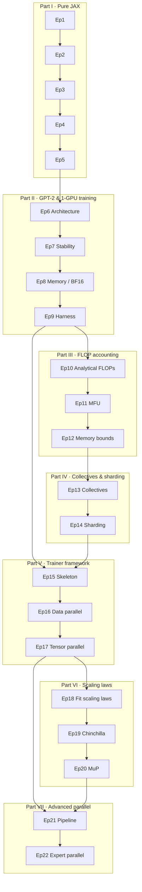

# ML Training Systems — Syllabus

Train a transformer. Understand every byte. Pure JAX from scratch — GPT-2 architecture, GB200 FLOP accounting, a real distributed training framework, scaling laws you fit yourself, pipeline and expert parallelism.

**Stack:** JAX · XLA · NCCL · 0 training libs

**Notebooks:** `epNN/solution.ipynb` (instructor) and `epNN/student.ipynb` (code along).

---

## Course length

**22 episodes** across seven parts. Karpathy-style: one idea per episode, short exercise at the end.

| Part | Episodes | Count |
|------|----------|-------|
| I — Pure JAX | 1–5 | 5 |
| II — GPT-2 & single-GPU training | 6–9 | 4 |
| III — FLOP accounting · GB200 | 10–12 | 3 |
| IV — Collectives & sharding | 13–14 | 2 |
| V — Distributed training framework | 15–17 | 3 |
| VI — Scaling laws · Chinchilla · MuP | 18–20 | 3 |
| VII — Pipeline & expert parallelism | 21–22 | 2 |

**Why this order:** FLOP accounting (10–12) tells you what a run *should* cost. Collectives (13) and sharding (14) are separate episodes — you need to understand *communication* and *array placement* before wiring them into a trainer. Part V builds the `Trainer`; Part VI runs scaling sweeps through it. Pipeline and expert parallelism come last.

---

## Course map

| Part | Title | Episodes |
|------|-------|----------|
| **I** | Pure JAX | 1–5 |
| **II** | GPT-2 Transformer & single-GPU training | 6–9 |
| **III** | FLOP Accounting · GB200 | 10–12 |
| **IV** | Collectives & Sharding | 13–14 |
| **V** | Distributed Training Framework | 15–17 |
| **VI** | Scaling Laws · Chinchilla · MuP | 18–20 |
| **VII** | Pipeline & Expert Parallelism | 21–22 |

---

## Part I — Pure JAX

5 episodes · no ML framework

| Episode | Topic |
|---------|-------|
| [1](./ep01/solution.ipynb) | JAX as a Functional Array Accelerator |
| [2](./ep02/solution.ipynb) | JIT, Tracing, and the Jaxpr |
| [3](./ep03/solution.ipynb) | Automatic Differentiation |
| [4](./ep04/solution.ipynb) | Control Flow with JIT |
| [5](./ep05/solution.ipynb) | Pytrees and SGD |

<details>
<summary>Episodes 1–5 — summaries</summary>

- **Ep1:** pure functions, PRNG keys, `jnp` vs NumPy, devices, async dispatch
- **Ep2:** tracing, jaxpr, `jit`, static args, recompilation, `make_jaxpr`
- **Ep3:** `grad`, `vjp`, `value_and_grad`, `jax.checkpoint` preview
- **Ep4:** `lax.cond`, `lax.*_loop`, `lax.scan`, control flow under `jit`
- **Ep5:** pytrees, `tree_map`, batched MLP, plain SGD, functional param updates

</details>

---

## Part II — GPT-2 & single-GPU training

4 episodes · builds on [`transformer.py`](./transformer.py)

| Episode | Topic | Status |
|---------|-------|--------|
| [6](./ep06/solution.ipynb) | GPT-2 Transformer in Pure JAX | ✅ |
| 7 | ML Optimizers | ✅ |
| 8 | Memory & mixed precision | planned |
| 9 | Single-GPU performance & training harness | planned |

### Episode 6 — GPT-2 Transformer in Pure JAX

**Job:** Understand the model byte-by-byte. Minimal training — not a production recipe.

**Concepts:** parameter PyTrees; pre-LN block; causal MHA; GELU MLP; weight-tied LM head; init; forward; cross-entropy; plain SGD; generation; `count_params`.

**Deferred to Ep7+:** Adam, LR schedules, BF16, activation checkpointing, grad clip.

---

### Episode 7 — ML Optimizers

**Prereq:** [Ep6](./ep06/solution.ipynb) — GPT-2 forward, cross-entropy, plain SGD.

**Job:** Implement first-order and matrix-aware optimizers as NamedTuple modules (`init` + `__call__`) and compare loss curves on the same GPT-2 model — still no Optax.

**Code:** [`ep07/helpers.py`](./ep07/helpers.py) · [`optimizer_curves.png`](./ep07/optimizer_curves.png) · notebooks [`solution.ipynb`](./ep07/solution.ipynb) / [`student.ipynb`](./ep07/student.ipynb).

**Builds on:** Ep6 transformer · Ep5 `jax.tree.map` · Ep3 `value_and_grad`.

**Concepts:**
- **NamedTuple modules** — GPT-2 and each optimizer: fields + `init` + `__call__`
- **Implement in-notebook:** SGD → Momentum → RMSProp → AdamW → Muon (skip Shampoo)
- **Pros/cons** before each optimizer; Distill + landscape demos for intuition
- **Pluggable train loop** — `train(..., optimizer=...)` from `helpers.py`

**Visualize:** [Distill — Momentum](https://distill.pub/2017/momentum/) ·
[Gradient Optimizer Comparison](https://www.corefranciscopark.com/blog/gradient-optimizer-comparison) ·
[`optimizer_curves.png`](./ep07/optimizer_curves.png)

**Still useful follow-ups (stability layer):** LR warmup + cosine, grad clipping, residual scaling ablations — can extend this episode or sit in a short coda before Ep8.

**Deferred to Ep8+:** BF16, activation checkpointing, gradient accumulation, `donate_argnums`, harness I/O, profiler.

**Key insight:** Diagonal adaptive methods reshape the step coordinate-wise; Muon/Shampoo reshape *matrix* updates. On a tiny corpus, regularization and LR still decide whether val keeps dropping — read the whole curve.

---

### Episode 8 — Memory & mixed precision

**Job:** Fit larger batch or sequence on one GPU; know where bytes go.

**Concepts:** memory budget (params + grads + Adam state + activations); `jax.checkpoint` on `block`; BF16 matmuls / FP32 master weights; `donate_argnums`; gradient accumulation.

---

### Episode 9 — Single-GPU performance & training harness

**Job:** A 1-GPU trainer worth extending — not the final framework, but the core loop it will wrap.

**Concepts:** `lax.scan` train loop; sequence-length bucketing; light `jax.profiler` intro; save/load PyTrees; val perplexity; reproducible config dict.

**Feeds into Part V:** Ep9's `train_step`, checkpoint I/O, and metrics become methods on the distributed `Trainer` in Ep15–17.

---

## Part III — FLOP accounting · GB200

3 episodes · math and measurement on the Ep9 harness (single device)

| Episode | Topic |
|---------|-------|
| 10 | Analytical FLOPs for GPT-2 |
| 11 | MFU & measured throughput |
| 12 | Memory bounds & arithmetic intensity |

### Episode 10 — Analytical FLOPs for GPT-2

Forward FLOPs/token — QKV projections, `S×S` attention, MLP matmuls, LM head; backward ≈ 2× forward; tie to Ep6 `count_params`.

**Exercise:** hand-compute forward FLOPs for `gpt2_small` at `S=1024`.

---

### Episode 11 — MFU & measured throughput

Tokens/sec from Ep9 → achieved FLOPs/sec → **MFU** = achieved / peak; GB200 peak BF16 specs; `jax.profiler` mapped to the Ep10 formula.

**Exercise:** compute MFU from a timed training run.

---

### Episode 12 — Memory bounds & arithmetic intensity

Why attention is memory-bound at moderate `S`; activation vs param bytes; where Ep8 checkpointing and BF16 land in the budget; FlashAttention as same math, different IO (footnote).

**Exercise:** predict compute-bound vs memory-bound for a given `(B, S, H, L)`.

**Key insight:** FLOP accounting is complete before you touch multiple devices — you need the formula and MFU baseline so distributed runs are debuggable.

---

## Part IV — Collectives & sharding

2 episodes · distributed **primitives only** — no `Trainer` yet

| Episode | Topic |
|---------|-------|
| 13 | Collectives |
| 14 | Sharding operations |

### Episode 13 — Collectives

**Job:** Understand the communication primitives that every parallelism strategy composes.

**Concepts:**
- All-reduce, all-gather, reduce-scatter, broadcast — what each does to tensor shards
- Bandwidth vs latency; ring vs tree (conceptual); NCCL under XLA
- `jax.lax` collective ops (`psum`, `all_gather`, `ppermute`, …) on a 2+ device `Mesh`
- Where each appears in training: grad all-reduce (DP), param/activation gather (TP), expert all-to-all (MoE preview)

**Exercise:** sum a sharded vector with all-reduce; gather shards and verify against a replicated reference.

**Key insight:** Collectives move bytes between devices; they don't decide *where* arrays live — that's sharding.

---

### Episode 14 — Sharding operations

**Job:** Place arrays on a device mesh — the declarative layer above collectives.

**Concepts:**
- `Mesh` and named axes (`'data'`, `'model'`, …)
- `PartitionSpec` — which tensor dim maps to which mesh axis
- `jax.device_put` with `NamedSharding`; `jax.make_sharded_array`
- `with_sharding_constraint` — pin intermediates inside `jit`
- `shard_map` — SPMD functions over mesh axes
- Sharding a parameter PyTree leaf-by-leaf; replicate vs shard worked examples on `(B, S, H)` activations

**Exercise:** shard a `(B, S, H)` batch on `'data'` and a `(H, H)` weight on `'model'`; run a matmul under `shard_map` and inspect per-device shards.

**Key insight:** Sharding is layout; collectives are synchronization. Data parallel and tensor parallel are different `PartitionSpec` choices plus the right collective in the backward pass.

---

## Part V — Distributed training framework

3 episodes · build a real `Trainer` on top of Ep9, using Ep13–14 primitives

Shared repo module (e.g. `trainer.py`) grows across these episodes:

```
Ep15  →  Trainer skeleton (single-device, sharding-ready)
Ep16  →  + data parallel
Ep17  →  + tensor parallel  →  framework ready for scaling sweeps
```

| Episode | Topic |
|---------|-------|
| 15 | Trainer skeleton |
| 16 | Data parallel |
| 17 | Tensor parallel |

### Episode 15 — Trainer skeleton

**Job:** Scaffolding that wraps Ep9's harness — not multi-device training yet.

**Concepts:**
- `TrainConfig` dataclass (model, batch, seq, opt, mesh shape, seed, paths)
- `Trainer` class: init, `train_step`, `train` loop, checkpoint I/O, metrics logger
- Single-device path first; mesh and `PartitionSpec` hooks wired but identity layout
- Structure `train_step` so Ep16–17 swap in sharded params/grads without API changes

**Exercise:** `Trainer` runs Ep9's Tiny Shakespeare loop on 1 device; save/load checkpoint round-trip.

---

### Episode 16 — Data parallel

**Job:** First real multi-device training via the framework.

**Concepts:**
- Replicate params across `'data'` axis; shard batch on `B` (Ep14 layouts)
- Gradient all-reduce inside `Trainer.train_step` (Ep13 collectives)
- Global batch size = `local_batch × num_devices`; LR scaling note (optional)
- Verify numerics: DP loss matches single-GPU at small scale

**Exercise:** train Tiny Shakespeare on 2+ devices through `Trainer`; log tokens/sec and MFU from Ep11.

**Key insight:** Data parallel doesn't change the math — the framework hides the collective behind the same `train_step` API.

---

### Episode 17 — Tensor parallel

**Job:** Extend the framework so the model itself is sharded — needed before scaling-law sweeps at widths that don't fit on one GPU.

**Concepts:**
- Shard linear layers and attention heads on `H` (Megatron-style)
- `PartitionSpec` on parameter PyTrees; TP + DP on the same `Mesh`
- `Trainer` selects parallelism mode from config (`dp`, `tp`, `dp+tp`)

**Exercise:** run a width sweep entry point (e.g. `trainer.run(config)`) at two hidden sizes that require TP; confirm checkpoint reload works.

**Key insight:** By Ep17 end you have one framework, one config object, one launch path — Part VI scaling experiments are just config sweeps through this API.

---

## Part VI — Scaling laws · Chinchilla · MuP

3 episodes · **uses the Part V `Trainer` for all experiments**

| Episode | Topic |
|---------|-------|
| 18 | Scaling laws — fit loss vs compute, data, and model size |
| 19 | Chinchilla — compute-optimal training |
| 20 | MuP — width transfer and hyperparameter scaling |

**Prerequisites:** Ep10–12 (FLOP budget per run) + Ep13–14 (primitives) + Ep15–17 (framework that launches multi-GPU sweeps).

### Episode 18 — Scaling laws

**Job:** Fit power-law curves from real training runs, not synthetic data.

**Concepts:**
- Sweep model width / depth / data tokens via `TrainConfig` grid
- Log total training FLOPs (Ep10) vs final val loss / perplexity
- Fit `L(C)`, `L(D)`, `L(N)`; isoFLOP curves
- Framework handles: launch, checkpoint, metric aggregation across runs

**Exercise:** fit `L(N)` from ≥3 widths using `Trainer`; plot on log-log axes.

---

### Episode 19 — Chinchilla

**Job:** Find compute-optimal model size for a fixed FLOP budget using the framework.

**Concepts:** Chinchilla prescription (train smaller models on more tokens); sweep along an isoFLOP line; read off optimal `N` and `D`.

**Exercise:** given a FLOP budget, pick optimal `(N, D)` from your fitted curves and launch one confirmatory run via `Trainer`.

---

### Episode 20 — MuP

**Job:** Transfer hyperparameters across width using the same launch path.

**Concepts:** μP init and LR scaling; tune on a small model, zero-shot transfer to large width with TP; compare to naive LR transfer.

**Exercise:** tune LR on `demo_config`; transfer to 2× width via `Trainer`; compare val loss at step 0 and after warmup.

**Key insight:** Scaling laws are only meaningful on infrastructure you trust — that's why they come after the framework, not before.

---

## Part VII — Pipeline & expert parallelism

2 episodes · extend the framework with schedule- and routing-based parallelism

| Episode | Topic |
|---------|-------|
| 21 | Pipeline parallelism |
| 22 | Expert parallelism (MoE) |

**Prerequisites:** Ep17 framework (DP + TP) + Ep18–20 (you understand when scaling stops being about FLOPs alone).

### Episode 21 — Pipeline parallelism

Micro-batching, bubble overhead, GPipe vs 1F1B; integrate as a `Trainer` parallelism mode alongside DP/TP.

### Episode 22 — Expert parallelism (MoE)

Router, top-k experts, expert parallel all-to-all (Ep13 collectives); when MoE changes the scaling story from Ep18.

---

## Dependency graph


```mermaid
flowchart TD
    subgraph P1["Part I · Pure JAX"]
        E1[Ep1] --> E2[Ep2] --> E3[Ep3] --> E4[Ep4] --> E5[Ep5]
    end

    subgraph P2["Part II · GPT-2 & 1-GPU training"]
        E6[Ep6 Architecture] --> E7[Ep7 Stability]
        E7 --> E8[Ep8 Memory / BF16]
        E8 --> E9[Ep9 Harness]
    end

    subgraph P3["Part III · FLOP accounting"]
        E10[Ep10 Analytical FLOPs] --> E11[Ep11 MFU]
        E11 --> E12[Ep12 Memory bounds]
    end

    subgraph P4["Part IV · Collectives & sharding"]
        E13[Ep13 Collectives] --> E14[Ep14 Sharding]
    end

    subgraph P5["Part V · Trainer framework"]
        E15[Ep15 Skeleton] --> E16[Ep16 Data parallel]
        E16 --> E17[Ep17 Tensor parallel]
    end

    subgraph P6["Part VI · Scaling laws"]
        E18[Ep18 Fit scaling laws] --> E19[Ep19 Chinchilla]
        E19 --> E20[Ep20 MuP]
    end

    subgraph P7["Part VII · Advanced parallel"]
        E21[Ep21 Pipeline] --> E22[Ep22 Expert parallel]
    end

    E5 --> E6
    E9 --> E10
    E9 --> E15
    E12 --> E13
    E14 --> E15
    E17 --> E18
    E17 --> E21
    E20 --> E21
```

---

## Design principles

1. **Ep6 = what the model is.** Training tricks wait until the architecture is understood.
2. **Ep7–9 = train reliably on one GPU** — harness becomes the core loop inside `Trainer`.
3. **Ep10–12 = account for compute and memory** — before multiple devices, know expected FLOPs and MFU.
4. **Ep13 = collectives, Ep14 = sharding** — separate episodes; communication vs layout.
5. **Ep15–17 = build the framework** — skeleton → DP → TP; one config, one launch API.
6. **Ep18–20 = scaling laws on real runs** — sweeps go through `Trainer`, not ad-hoc notebooks.
7. **Ep21–22 = advanced parallelism** — PP and MoE extend the same framework.

---

## Framework API sketch (evolves Ep15 → Ep17)

Reference shape for the repo module students build across Part V:

```python
@dataclass
class TrainConfig:
    model: GPTConfig
    mesh_shape: tuple[int, ...]      # e.g. (dp, tp)
    parallelism: Literal["dp", "tp", "dp_tp"]
    batch_size: int                  # global
    seq_len: int
    max_steps: int
    learning_rate: float
    # ... checkpoint path, seed, log_every

class Trainer:
    def __init__(self, config: TrainConfig): ...
    def train_step(self, state, batch) -> state: ...   # sharded
    def train(self) -> RunMetrics: ...                  # full loop
    def save(self, path): ...
    def load(self, path): ...
    @staticmethod
    def sweep(configs: list[TrainConfig]) -> list[RunMetrics]: ...  # Ep18+
```

Part VI exercises are expressed as `TrainConfig` grids and `Trainer.sweep` — the curve fitting reads aggregated metrics, not raw notebook state.
